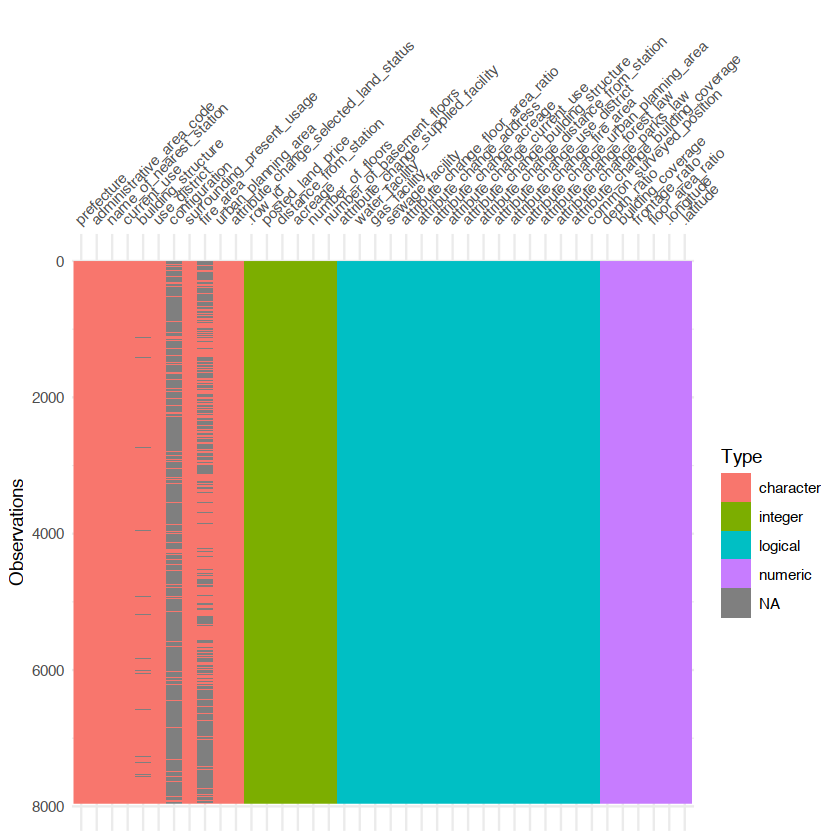
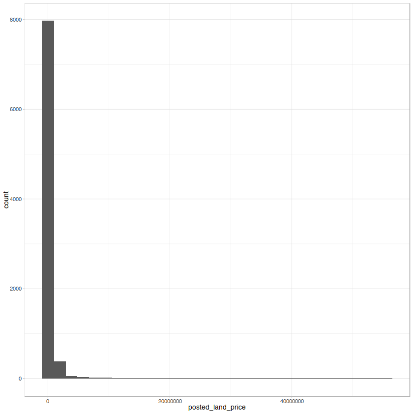

{:.input_area}
```R
source(here::here("R/setup.R"))
```


# 探索的データ分析

データを料理する前に、どのようなデータが与えられているのか確認することが大切です。この段階を踏むことで、データに対する理解が深まり、より良いモデルの構築に繋がる可能性もあります。こうした一連の作業は探索的データ分析 (Exploratory Data Analysis: EDA)と呼ばれます。この作業には、データの集計、要約、可視化が含まれます。

EDAがデータ分析の作業において早期段階で行われるのは、データの異常（思い込みとの比較を含めて）や特徴を把握するためです。これらは分析全体のアプローチや良い出発点を見つけるために有効です。出発点と表現したのは、モデルの構築や特徴量の生成によって改めてデータを見つめ直す作業が発生するためです。そのため必ずしも徹底的である必要はありません。

前章でもデータについて簡単な調査を行いましたが、データをグラフによって表現してみましょう。グラフにすることで、集計値では見えなかった情報やデータ間の関係を表現できます。

特に欠損値や異常値（外れ値）、データの分布などデータ全体あるいはデータ間の関係性やそのばらつきを見るのに可視化は重要です。なお欠損値の視覚化については別の章で解説します。

## データを眺める

目的変数として設定する地価価格に影響を及ぼす変数を明らかにしたい、またその関係を知りたいという状況を設定します。

<!-- ここで扱うデータは地価公示データのみ。他のデータ、地価公示データの紹介は別のノート (`dataset/`)で。基本的に説明は地価公示データベース。データの性質に合わせて利用する。 -->

- サイズ（列数、行数）
- 各列のデータ型
- 完全データ、欠損データ

データを手に入れたら、分析作業へ取り掛かる前にまずはデータを眺めてみることにしましょう。眺める、と言ってもデータの値を1つずつ見ていくわけではありません。これから扱うデータにはどのような値が含まれているのか、データ型が処理されているか、また全体の大きさはどれくらいなのか欠損はどれだけあるかと言った情報を俯瞰的に整理していきます。

### データの大きさ

データフレームは行と列からなります。いくつかの関数を使って読み込んだデータの大きさを調べてみましょう。


{:.input_area}
```R
dim(df_lp_kanto)
```


<div markdown="0" class="output output_html">
<ol class=list-inline>
	<li>8476</li>
	<li>45</li>
</ol>

</div>


`dim()`をデータフレームに適用すると、そのサイズを数値ベクトルで返します。最初の要素が行数、2番目の数字が列数を示します。これは次の`ncol()`、`nrow()`により個別に求めることができます。


{:.input_area}
```R
nrow(df_lp_kanto)
ncol(df_lp_kanto)
```


<div markdown="0" class="output output_html">
8476
</div>


<div markdown="0" class="output output_html">
45
</div>


### データの一部を表示

データフレームの一部を表示して、列名と値の確認をしてみましょう。`head()`をデータフレームに対して実行すると先頭の数行を表示します。また`tail()` でデータフレームの最後の行を表示できます。いずれの関数も引数`n = ` に実数を与えることで表示される行数を制御可能です。


{:.input_area}
```R
head(df_lp_kanto)

tail(df_lp_kanto, n = 3)
```


<div markdown="0" class="output output_html">
<table>
<caption>A tibble: 6 × 45</caption>
<thead>
	<tr><th scope=col>.row_id</th><th scope=col>.prefecture</th><th scope=col>administrative_area_code</th><th scope=col>posted_land_price</th><th scope=col>name_of_nearest_station</th><th scope=col>distance_from_station</th><th scope=col>acreage</th><th scope=col>current_use</th><th scope=col>usage_description</th><th scope=col>building_structure</th><th scope=col>⋯</th><th scope=col>attribute_change_use_district</th><th scope=col>attribute_change_fire_area</th><th scope=col>attribute_change_urban_planning_area</th><th scope=col>attribute_change_forest_law</th><th scope=col>attribute_change_parks_law</th><th scope=col>attribute_change_building_coverage</th><th scope=col>common_surveyed_position</th><th scope=col>.longitude</th><th scope=col>.latitude</th><th scope=col>night_population</th></tr>
	<tr><th scope=col>&lt;int&gt;</th><th scope=col>&lt;chr&gt;</th><th scope=col>&lt;chr&gt;</th><th scope=col>&lt;int&gt;</th><th scope=col>&lt;chr&gt;</th><th scope=col>&lt;int&gt;</th><th scope=col>&lt;int&gt;</th><th scope=col>&lt;chr&gt;</th><th scope=col>&lt;chr&gt;</th><th scope=col>&lt;chr&gt;</th><th scope=col>⋯</th><th scope=col>&lt;lgl&gt;</th><th scope=col>&lt;lgl&gt;</th><th scope=col>&lt;lgl&gt;</th><th scope=col>&lt;lgl&gt;</th><th scope=col>&lt;lgl&gt;</th><th scope=col>&lt;lgl&gt;</th><th scope=col>&lt;lgl&gt;</th><th scope=col>&lt;dbl&gt;</th><th scope=col>&lt;dbl&gt;</th><th scope=col>&lt;dbl&gt;</th></tr>
</thead>
<tbody>
	<tr><td>13534</td><td>群馬県</td><td>10425</td><td> 4150</td><td>万座・鹿沢口</td><td> 8700</td><td>317</td><td>住宅,その他</td><td>別荘</td><td>W1</td><td>⋯</td><td>FALSE</td><td>FALSE</td><td>FALSE</td><td>FALSE</td><td>FALSE</td><td>FALSE</td><td>FALSE</td><td>138.5383</td><td>36.46920</td><td>9780</td></tr>
	<tr><td>13604</td><td>群馬県</td><td>10426</td><td>39000</td><td>長野原草津口</td><td>13000</td><td>166</td><td>住宅       </td><td>NA  </td><td>W2</td><td>⋯</td><td>FALSE</td><td>FALSE</td><td>FALSE</td><td>FALSE</td><td>FALSE</td><td>FALSE</td><td>FALSE</td><td>138.5921</td><td>36.61913</td><td>6518</td></tr>
	<tr><td>13605</td><td>群馬県</td><td>10426</td><td>56800</td><td>長野原草津口</td><td>13000</td><td>226</td><td>店舗       </td><td>NA  </td><td>W1</td><td>⋯</td><td>FALSE</td><td>FALSE</td><td>FALSE</td><td>FALSE</td><td>FALSE</td><td>FALSE</td><td>FALSE</td><td>138.5933</td><td>36.62025</td><td>6518</td></tr>
	<tr><td>13613</td><td>群馬県</td><td>10424</td><td> 2700</td><td>羽根尾      </td><td> 5500</td><td>274</td><td>住宅,その他</td><td>別荘</td><td>W2</td><td>⋯</td><td>FALSE</td><td>FALSE</td><td>FALSE</td><td>FALSE</td><td>FALSE</td><td>FALSE</td><td>FALSE</td><td>138.6017</td><td>36.52271</td><td>5536</td></tr>
	<tr><td>13620</td><td>群馬県</td><td>10424</td><td>12100</td><td>羽根尾      </td><td>   80</td><td>357</td><td>住宅       </td><td>NA  </td><td>W2</td><td>⋯</td><td>FALSE</td><td>FALSE</td><td>FALSE</td><td>FALSE</td><td>FALSE</td><td>FALSE</td><td>FALSE</td><td>138.6058</td><td>36.54922</td><td>5536</td></tr>
	<tr><td>13621</td><td>群馬県</td><td>10426</td><td>29800</td><td>長野原草津口</td><td>14000</td><td>173</td><td>住宅       </td><td>NA  </td><td>W2</td><td>⋯</td><td>FALSE</td><td>FALSE</td><td>FALSE</td><td>FALSE</td><td>FALSE</td><td>FALSE</td><td>FALSE</td><td>138.6083</td><td>36.62088</td><td>6518</td></tr>
</tbody>
</table>

</div>


<div markdown="0" class="output output_html">
<table>
<caption>A tibble: 3 × 45</caption>
<thead>
	<tr><th scope=col>.row_id</th><th scope=col>.prefecture</th><th scope=col>administrative_area_code</th><th scope=col>posted_land_price</th><th scope=col>name_of_nearest_station</th><th scope=col>distance_from_station</th><th scope=col>acreage</th><th scope=col>current_use</th><th scope=col>usage_description</th><th scope=col>building_structure</th><th scope=col>⋯</th><th scope=col>attribute_change_use_district</th><th scope=col>attribute_change_fire_area</th><th scope=col>attribute_change_urban_planning_area</th><th scope=col>attribute_change_forest_law</th><th scope=col>attribute_change_parks_law</th><th scope=col>attribute_change_building_coverage</th><th scope=col>common_surveyed_position</th><th scope=col>.longitude</th><th scope=col>.latitude</th><th scope=col>night_population</th></tr>
	<tr><th scope=col>&lt;int&gt;</th><th scope=col>&lt;chr&gt;</th><th scope=col>&lt;chr&gt;</th><th scope=col>&lt;int&gt;</th><th scope=col>&lt;chr&gt;</th><th scope=col>&lt;int&gt;</th><th scope=col>&lt;int&gt;</th><th scope=col>&lt;chr&gt;</th><th scope=col>&lt;chr&gt;</th><th scope=col>&lt;chr&gt;</th><th scope=col>⋯</th><th scope=col>&lt;lgl&gt;</th><th scope=col>&lt;lgl&gt;</th><th scope=col>&lt;lgl&gt;</th><th scope=col>&lt;lgl&gt;</th><th scope=col>&lt;lgl&gt;</th><th scope=col>&lt;lgl&gt;</th><th scope=col>&lt;lgl&gt;</th><th scope=col>&lt;dbl&gt;</th><th scope=col>&lt;dbl&gt;</th><th scope=col>&lt;dbl&gt;</th></tr>
</thead>
<tbody>
	<tr><td>23818</td><td>茨城県</td><td>08232</td><td>15600</td><td>銚子</td><td>3200</td><td>125</td><td>住宅     </td><td>NA</td><td>W2</td><td>⋯</td><td>FALSE</td><td>FALSE</td><td>FALSE</td><td>FALSE</td><td>FALSE</td><td>FALSE</td><td>FALSE</td><td>140.8311</td><td>35.74772</td><td>94522</td></tr>
	<tr><td>23839</td><td>千葉県</td><td>12202</td><td>41200</td><td>銚子</td><td>1800</td><td>119</td><td>住宅,店舗</td><td>NA</td><td>S3</td><td>⋯</td><td>FALSE</td><td>FALSE</td><td>FALSE</td><td>FALSE</td><td>FALSE</td><td>FALSE</td><td>FALSE</td><td>140.8434</td><td>35.73295</td><td>64415</td></tr>
	<tr><td>23851</td><td>千葉県</td><td>12202</td><td>31500</td><td>銚子</td><td>2200</td><td>111</td><td>住宅     </td><td>NA</td><td>W2</td><td>⋯</td><td>FALSE</td><td>FALSE</td><td>FALSE</td><td>FALSE</td><td>FALSE</td><td>FALSE</td><td>FALSE</td><td>140.8480</td><td>35.73405</td><td>64415</td></tr>
</tbody>
</table>

</div>


### 各列の情報

データ型や件数、欠損の状況を調べます。


{:.input_area}
```R
glimpse(df_lp_kanto)
```


{:.output .output_stream}
```
Observations: 8,476
Variables: 45
$ .row_id                                <int> 13534, 13604, 13605, 13613, 1…
$ .prefecture                            <chr> "群馬県", "群馬県", "群馬県", "群馬県", "…
$ administrative_area_code               <chr> "10425", "10426", "10426", "1…
$ posted_land_price                      <int> 4150, 39000, 56800, 2700, 121…
$ name_of_nearest_station                <chr> "万座・鹿沢口", "長野原草津口", "長野原草津口",…
$ distance_from_station                  <int> 8700, 13000, 13000, 5500, 80,…
$ acreage                                <int> 317, 166, 226, 274, 357, 173,…
$ current_use                            <chr> "住宅,その他", "住宅", "店舗", "住宅,その他…
$ usage_description                      <chr> "別荘", NA, NA, "別荘", NA, NA, N…
$ building_structure                     <chr> "W1", "W2", "W1", "W2", "W2",…
$ attribute_change_supplied_facility     <lgl> FALSE, FALSE, FALSE, FALSE, F…
$ water_facility                         <lgl> TRUE, TRUE, TRUE, TRUE, TRUE,…
$ gas_facility                           <lgl> FALSE, FALSE, FALSE, FALSE, F…
$ sewage_facility                        <lgl> FALSE, TRUE, TRUE, TRUE, TRUE…
$ proximity_with_transportation_facility <chr> NA, NA, NA, NA, NA, NA, NA, N…
$ depth_ratio                            <dbl> 1.0, 1.0, 2.0, 2.0, 1.5, 1.0,…
$ number_of_floors                       <int> 1, 2, 1, 2, 2, 2, 2, 1, 2, 2,…
$ number_of_basement_floors              <int> 0, 0, 0, 0, 0, 0, 0, 0, 0, 0,…
$ use_district                           <chr> NA, "2住居", "近商", NA, NA, "2住居…
$ building_coverage                      <dbl> 0, 60, 80, 70, 70, 60, 70, 70…
$ configuration                          <chr> NA, NA, "台形", NA, NA, NA, "台形…
$ surrounding_present_usage              <chr> "低層別荘が建ち並ぶ環境の良い別荘地域", "一般住宅の中…
$ fire_area                              <chr> NA, NA, NA, NA, NA, NA, NA, N…
$ urban_planning_area                    <chr> "都計外", "非線引", "非線引", "非線引", "…
$ forest_law                             <chr> NA, NA, NA, NA, NA, NA, NA, N…
$ parks_law                              <chr> NA, NA, NA, NA, NA, NA, NA, N…
$ attribute_change_floor_area_ratio      <lgl> FALSE, FALSE, FALSE, FALSE, F…
$ frontage_ratio                         <dbl> 1.2, 1.2, 1.0, 1.0, 1.0, 1.0,…
$ floor_area_ratio                       <dbl> 0, 200, 300, 400, 400, 200, 4…
$ attribute_change_selected_land_status  <dbl> 1, 1, 1, 1, 1, 1, 1, 1, 1, 1,…
$ attribute_change_address               <lgl> FALSE, FALSE, FALSE, FALSE, F…
$ attribute_change_acreage               <lgl> FALSE, FALSE, FALSE, FALSE, F…
$ attribute_change_current_use           <lgl> FALSE, FALSE, FALSE, FALSE, F…
$ attribute_change_building_structure    <lgl> FALSE, FALSE, FALSE, FALSE, F…
$ attribute_change_distance_from_station <lgl> FALSE, FALSE, FALSE, FALSE, F…
$ attribute_change_use_district          <lgl> FALSE, FALSE, FALSE, FALSE, F…
$ attribute_change_fire_area             <lgl> FALSE, FALSE, FALSE, FALSE, F…
$ attribute_change_urban_planning_area   <lgl> FALSE, FALSE, FALSE, FALSE, F…
$ attribute_change_forest_law            <lgl> FALSE, FALSE, FALSE, FALSE, F…
$ attribute_change_parks_law             <lgl> FALSE, FALSE, FALSE, FALSE, F…
$ attribute_change_building_coverage     <lgl> FALSE, FALSE, FALSE, FALSE, F…
$ common_surveyed_position               <lgl> FALSE, FALSE, FALSE, FALSE, F…
$ .longitude                             <dbl> 138.5383, 138.5921, 138.5933,…
$ .latitude                              <dbl> 36.46920, 36.61913, 36.62025,…
$ night_population                       <dbl> 9780, 6518, 6518, 5536, 5536,…

```

この地価公示データには45の列（変数）があります。

- データの型 (`character`, `numeric`, `logical`, `factor`)
- 欠損数、ユニーク数
- 文字データの長さの幅
- カテゴリデータの偏り、水準、順序
- 数値データの要約統計量、分布（ヒストグラム）

- `configuration`や`fire_area`は欠損を多く含んでいることがわかります。`building_structure`にもわずかですが欠損データがあります


{:.input_area}
```R
# 同一のデータで重複があるもの
df_lp_kanto %>% 
  tidyr::separate_rows("current_use", sep = ",") %>% 
  count(.row_id) %>% 
  filter(n > 1) %>% 
  distinct(.row_id) %>% 
  nrow() %>% 
  ensure(. == 1986L)
```


<div markdown="0" class="output output_html">
1986
</div>


明確な答えがあるわけではありませんが、以下の情報はデータ全体、各変数について把握しておくと良いでしょう。またデータの偏りや出現傾向、分布のパターンは可視化を行い確認するのが効率的です。

## 要約統計量の算出


{:.input_area}
```R
summary(df_lp_kanto)
```


{:.output .output_data_text}
```
    .row_id      .prefecture        administrative_area_code posted_land_price 
 Min.   :13534   Length:8476        Length:8476              Min.   :     613  
 1st Qu.:16404   Class :character   Class :character         1st Qu.:   59900  
 Median :18532   Mode  :character   Mode  :character         Median :  155000  
 Mean   :18584                                               Mean   :  415432  
 3rd Qu.:20708                                               3rd Qu.:  308000  
 Max.   :23851                                               Max.   :55500000  
 name_of_nearest_station distance_from_station    acreage      
 Length:8476             Min.   :    0         Min.   :    46  
 Class :character        1st Qu.:  500         1st Qu.:   140  
 Mode  :character        Median : 1000         Median :   181  
                         Mean   : 1566         Mean   :   751  
                         3rd Qu.: 1800         3rd Qu.:   272  
                         Max.   :24000         Max.   :413215  
 current_use        usage_description  building_structure
 Length:8476        Length:8476        Length:8476       
 Class :character   Class :character   Class :character  
 Mode  :character   Mode  :character   Mode  :character  
                                                         
                                                         
                                                         
 attribute_change_supplied_facility water_facility  gas_facility   
 Mode :logical                      Mode :logical   Mode :logical  
 FALSE:8429                         FALSE:49        FALSE:1860     
 TRUE :47                           TRUE :8427      TRUE :6616     
                                                                   
                                                                   
                                                                   
 sewage_facility proximity_with_transportation_facility  depth_ratio   
 Mode :logical   Length:8476                            Min.   :0.000  
 FALSE:701       Class :character                       1st Qu.:1.000  
 TRUE :7775      Mode  :character                       Median :1.200  
                                                        Mean   :1.459  
                                                        3rd Qu.:1.500  
                                                        Max.   :6.500  
 number_of_floors number_of_basement_floors use_district      
 Min.   : 0.000   Min.   :0.00000           Length:8476       
 1st Qu.: 2.000   1st Qu.:0.00000           Class :character  
 Median : 2.000   Median :0.00000           Mode  :character  
 Mean   : 2.718   Mean   :0.07574                             
 3rd Qu.: 2.000   3rd Qu.:0.00000                             
 Max.   :52.000   Max.   :6.00000                             
 building_coverage configuration      surrounding_present_usage
 Min.   : 0.00     Length:8476        Length:8476              
 1st Qu.:50.00     Class :character   Class :character         
 Median :60.00     Mode  :character   Mode  :character         
 Mean   :60.17                                                 
 3rd Qu.:60.00                                                 
 Max.   :80.00                                                 
  fire_area         urban_planning_area  forest_law         parks_law        
 Length:8476        Length:8476         Length:8476        Length:8476       
 Class :character   Class :character    Class :character   Class :character  
 Mode  :character   Mode  :character    Mode  :character   Mode  :character  
                                                                             
                                                                             
                                                                             
 attribute_change_floor_area_ratio frontage_ratio  floor_area_ratio
 Mode :logical                     Min.   :0.000   Min.   :   0.0  
 FALSE:8474                        1st Qu.:1.000   1st Qu.: 100.0  
 TRUE :2                           Median :1.000   Median : 200.0  
                                   Mean   :1.066   Mean   : 216.6  
                                   3rd Qu.:1.000   3rd Qu.: 200.0  
                                   Max.   :5.500   Max.   :1300.0  
 attribute_change_selected_land_status attribute_change_address
 Min.   :1.000                         Mode :logical           
 1st Qu.:1.000                         FALSE:8411              
 Median :1.000                         TRUE :65                
 Mean   :1.027                                                 
 3rd Qu.:1.000                                                 
 Max.   :4.000                                                 
 attribute_change_acreage attribute_change_current_use
 Mode :logical            Mode :logical               
 FALSE:8450               FALSE:8402                  
 TRUE :26                 TRUE :74                    
                                                      
                                                      
                                                      
 attribute_change_building_structure attribute_change_distance_from_station
 Mode :logical                       Mode :logical                         
 FALSE:8406                          FALSE:8431                            
 TRUE :70                            TRUE :45                              
                                                                           
                                                                           
                                                                           
 attribute_change_use_district attribute_change_fire_area
 Mode :logical                 Mode :logical             
 FALSE:8475                    FALSE:8417                
 TRUE :1                       TRUE :59                  
                                                         
                                                         
                                                         
 attribute_change_urban_planning_area attribute_change_forest_law
 Mode :logical                        Mode :logical              
 FALSE:8475                           FALSE:8476                 
 TRUE :1                                                         
                                                                 
                                                                 
                                                                 
 attribute_change_parks_law attribute_change_building_coverage
 Mode :logical              Mode :logical                     
 FALSE:8476                 FALSE:8474                        
                            TRUE :2                           
                                                              
                                                              
                                                              
 common_surveyed_position   .longitude      .latitude     night_population
 Mode :logical            Min.   :138.5   Min.   :34.98   Min.   :  3214  
 FALSE:7870               1st Qu.:139.5   1st Qu.:35.59   1st Qu.:118919  
 TRUE :606                Median :139.7   Median :35.72   Median :200012  
                          Mean   :139.7   Mean   :35.79   Mean   :259450  
                          3rd Qu.:139.9   3rd Qu.:35.92   3rd Qu.:341076  
                          Max.   :140.8   Max.   :37.02   Max.   :903346  
```


Rの組み込み関数として用意されている `summary()` を利用して、データフレームに含まれる列の要約統計量を得ることができます。


{:.input_area}
```R
# 論理値型で標準偏差0の列を特定 constant cols
df_lp_kanto %>% 
  select(-starts_with(".")) %>% 
  select_if(is.logical) %>% 
  mutate_all(as.numeric) %>% 
  summarise_all(sd) %>% 
  tidyr::gather()
```


<div markdown="0" class="output output_html">
<table>
<caption>A tibble: 17 × 2</caption>
<thead>
	<tr><th scope=col>key</th><th scope=col>value</th></tr>
	<tr><th scope=col>&lt;chr&gt;</th><th scope=col>&lt;dbl&gt;</th></tr>
</thead>
<tbody>
	<tr><td>attribute_change_supplied_facility    </td><td>0.07426285</td></tr>
	<tr><td>water_facility                        </td><td>0.07581746</td></tr>
	<tr><td>gas_facility                          </td><td>0.41389377</td></tr>
	<tr><td>sewage_facility                       </td><td>0.27545070</td></tr>
	<tr><td>attribute_change_floor_area_ratio     </td><td>0.01536009</td></tr>
	<tr><td>attribute_change_address              </td><td>0.08723990</td></tr>
	<tr><td>attribute_change_acreage              </td><td>0.05530313</td></tr>
	<tr><td>attribute_change_current_use          </td><td>0.09303404</td></tr>
	<tr><td>attribute_change_building_structure   </td><td>0.09050621</td></tr>
	<tr><td>attribute_change_distance_from_station</td><td>0.07267424</td></tr>
	<tr><td>attribute_change_use_district         </td><td>0.01086187</td></tr>
	<tr><td>attribute_change_fire_area            </td><td>0.08314561</td></tr>
	<tr><td>attribute_change_urban_planning_area  </td><td>0.01086187</td></tr>
	<tr><td>attribute_change_forest_law           </td><td>0.00000000</td></tr>
	<tr><td>attribute_change_parks_law            </td><td>0.00000000</td></tr>
	<tr><td>attribute_change_building_coverage    </td><td>0.01536009</td></tr>
	<tr><td>common_surveyed_position              </td><td>0.25766673</td></tr>
</tbody>
</table>

</div>


ここでは `skimr::` で行う例を示します。


{:.input_area}
```R
# skimr::skim(df_lp) # Rコンソールでの実行は skim() で構いません
df_lp_kanto %>% 
  select(-starts_with(".")) %>% 
  skimr::skim_to_list()
```


<div markdown="0" class="output output_html">
<dl>
	<dt>$character</dt>
		<dd><table>
<caption>A tbl: 13 × 8</caption>
<thead>
	<tr><th scope=col>variable</th><th scope=col>missing</th><th scope=col>complete</th><th scope=col>n</th><th scope=col>min</th><th scope=col>max</th><th scope=col>empty</th><th scope=col>n_unique</th></tr>
	<tr><th scope=col>&lt;chr&gt;</th><th scope=col>&lt;chr&gt;</th><th scope=col>&lt;chr&gt;</th><th scope=col>&lt;chr&gt;</th><th scope=col>&lt;chr&gt;</th><th scope=col>&lt;chr&gt;</th><th scope=col>&lt;chr&gt;</th><th scope=col>&lt;chr&gt;</th></tr>
</thead>
<tbody>
	<tr><td>administrative_area_code              </td><td>0   </td><td>8476</td><td>8476</td><td>5 </td><td>5 </td><td>0</td><td>329 </td></tr>
	<tr><td>building_structure                    </td><td>220 </td><td>8256</td><td>8476</td><td>2 </td><td>8 </td><td>0</td><td>130 </td></tr>
	<tr><td>configuration                         </td><td>7454</td><td>1022</td><td>8476</td><td>2 </td><td>3 </td><td>0</td><td>2   </td></tr>
	<tr><td>current_use                           </td><td>0   </td><td>8476</td><td>8476</td><td>2 </td><td>14</td><td>0</td><td>70  </td></tr>
	<tr><td>fire_area                             </td><td>4859</td><td>3617</td><td>8476</td><td>2 </td><td>2 </td><td>0</td><td>2   </td></tr>
	<tr><td>forest_law                            </td><td>8450</td><td>26  </td><td>8476</td><td>3 </td><td>3 </td><td>0</td><td>1   </td></tr>
	<tr><td>name_of_nearest_station               </td><td>0   </td><td>8476</td><td>8476</td><td>1 </td><td>14</td><td>0</td><td>1481</td></tr>
	<tr><td>parks_law                             </td><td>8465</td><td>11  </td><td>8476</td><td>7 </td><td>7 </td><td>0</td><td>2   </td></tr>
	<tr><td>proximity_with_transportation_facility</td><td>8308</td><td>168 </td><td>8476</td><td>2 </td><td>6 </td><td>0</td><td>3   </td></tr>
	<tr><td>surrounding_present_usage             </td><td>0   </td><td>8476</td><td>8476</td><td>15</td><td>22</td><td>0</td><td>4397</td></tr>
	<tr><td>urban_planning_area                   </td><td>0   </td><td>8476</td><td>8476</td><td>2 </td><td>3 </td><td>0</td><td>4   </td></tr>
	<tr><td>usage_description                     </td><td>7552</td><td>924 </td><td>8476</td><td>1 </td><td>8 </td><td>0</td><td>40  </td></tr>
	<tr><td>use_district                          </td><td>515 </td><td>7961</td><td>8476</td><td>2 </td><td>3 </td><td>0</td><td>12  </td></tr>
</tbody>
</table>
</dd>
	<dt>$integer</dt>
		<dd><table>
<caption>A tbl: 5 × 12</caption>
<thead>
	<tr><th scope=col>variable</th><th scope=col>missing</th><th scope=col>complete</th><th scope=col>n</th><th scope=col>mean</th><th scope=col>sd</th><th scope=col>p0</th><th scope=col>p25</th><th scope=col>p50</th><th scope=col>p75</th><th scope=col>p100</th><th scope=col>hist</th></tr>
	<tr><th scope=col>&lt;chr&gt;</th><th scope=col>&lt;chr&gt;</th><th scope=col>&lt;chr&gt;</th><th scope=col>&lt;chr&gt;</th><th scope=col>&lt;chr&gt;</th><th scope=col>&lt;chr&gt;</th><th scope=col>&lt;chr&gt;</th><th scope=col>&lt;chr&gt;</th><th scope=col>&lt;chr&gt;</th><th scope=col>&lt;chr&gt;</th><th scope=col>&lt;chr&gt;</th><th scope=col>&lt;chr&gt;</th></tr>
</thead>
<tbody>
	<tr><td>acreage                  </td><td>0</td><td>8476</td><td>8476</td><td>   750.95 </td><td>   7246.83</td><td>46 </td><td>140  </td><td>181   </td><td>272   </td><td>413215  </td><td>▇▁▁▁▁▁▁▁</td></tr>
	<tr><td>distance_from_station    </td><td>0</td><td>8476</td><td>8476</td><td>  1565.6  </td><td>   1964.8 </td><td>0  </td><td>500  </td><td>1000  </td><td>1800  </td><td>24000   </td><td>▇▁▁▁▁▁▁▁</td></tr>
	<tr><td>number_of_basement_floors</td><td>0</td><td>8476</td><td>8476</td><td>     0.076</td><td>      0.33</td><td>0  </td><td>0    </td><td>0     </td><td>0     </td><td>6       </td><td>▇▁▁▁▁▁▁▁</td></tr>
	<tr><td>number_of_floors         </td><td>0</td><td>8476</td><td>8476</td><td>     2.72 </td><td>      2.22</td><td>0  </td><td>2    </td><td>2     </td><td>2     </td><td>52      </td><td>▇▁▁▁▁▁▁▁</td></tr>
	<tr><td>posted_land_price        </td><td>0</td><td>8476</td><td>8476</td><td>415431.75 </td><td>1766361.43</td><td>613</td><td>59900</td><td>155000</td><td>308000</td><td>55500000</td><td>▇▁▁▁▁▁▁▁</td></tr>
</tbody>
</table>
</dd>
	<dt>$logical</dt>
		<dd><table>
<caption>A tbl: 17 × 6</caption>
<thead>
	<tr><th scope=col>variable</th><th scope=col>missing</th><th scope=col>complete</th><th scope=col>n</th><th scope=col>mean</th><th scope=col>count</th></tr>
	<tr><th scope=col>&lt;chr&gt;</th><th scope=col>&lt;chr&gt;</th><th scope=col>&lt;chr&gt;</th><th scope=col>&lt;chr&gt;</th><th scope=col>&lt;chr&gt;</th><th scope=col>&lt;chr&gt;</th></tr>
</thead>
<tbody>
	<tr><td>attribute_change_acreage              </td><td>0</td><td>8476</td><td>8476</td><td>0.0031 </td><td>FAL: 8450, TRU: 26, NA: 0  </td></tr>
	<tr><td>attribute_change_address              </td><td>0</td><td>8476</td><td>8476</td><td>0.0077 </td><td>FAL: 8411, TRU: 65, NA: 0  </td></tr>
	<tr><td>attribute_change_building_coverage    </td><td>0</td><td>8476</td><td>8476</td><td>0.00024</td><td>FAL: 8474, TRU: 2, NA: 0   </td></tr>
	<tr><td>attribute_change_building_structure   </td><td>0</td><td>8476</td><td>8476</td><td>0.0083 </td><td>FAL: 8406, TRU: 70, NA: 0  </td></tr>
	<tr><td>attribute_change_current_use          </td><td>0</td><td>8476</td><td>8476</td><td>0.0087 </td><td>FAL: 8402, TRU: 74, NA: 0  </td></tr>
	<tr><td>attribute_change_distance_from_station</td><td>0</td><td>8476</td><td>8476</td><td>0.0053 </td><td>FAL: 8431, TRU: 45, NA: 0  </td></tr>
	<tr><td>attribute_change_fire_area            </td><td>0</td><td>8476</td><td>8476</td><td>0.007  </td><td>FAL: 8417, TRU: 59, NA: 0  </td></tr>
	<tr><td>attribute_change_floor_area_ratio     </td><td>0</td><td>8476</td><td>8476</td><td>0.00024</td><td>FAL: 8474, TRU: 2, NA: 0   </td></tr>
	<tr><td>attribute_change_forest_law           </td><td>0</td><td>8476</td><td>8476</td><td>0      </td><td>FAL: 8476, NA: 0           </td></tr>
	<tr><td>attribute_change_parks_law            </td><td>0</td><td>8476</td><td>8476</td><td>0      </td><td>FAL: 8476, NA: 0           </td></tr>
	<tr><td>attribute_change_supplied_facility    </td><td>0</td><td>8476</td><td>8476</td><td>0.0055 </td><td>FAL: 8429, TRU: 47, NA: 0  </td></tr>
	<tr><td>attribute_change_urban_planning_area  </td><td>0</td><td>8476</td><td>8476</td><td>0.00012</td><td>FAL: 8475, TRU: 1, NA: 0   </td></tr>
	<tr><td>attribute_change_use_district         </td><td>0</td><td>8476</td><td>8476</td><td>0.00012</td><td>FAL: 8475, TRU: 1, NA: 0   </td></tr>
	<tr><td>common_surveyed_position              </td><td>0</td><td>8476</td><td>8476</td><td>0.071  </td><td>FAL: 7870, TRU: 606, NA: 0 </td></tr>
	<tr><td>gas_facility                          </td><td>0</td><td>8476</td><td>8476</td><td>0.78   </td><td>TRU: 6616, FAL: 1860, NA: 0</td></tr>
	<tr><td>sewage_facility                       </td><td>0</td><td>8476</td><td>8476</td><td>0.92   </td><td>TRU: 7775, FAL: 701, NA: 0 </td></tr>
	<tr><td>water_facility                        </td><td>0</td><td>8476</td><td>8476</td><td>0.99   </td><td>TRU: 8427, FAL: 49, NA: 0  </td></tr>
</tbody>
</table>
</dd>
	<dt>$numeric</dt>
		<dd><table>
<caption>A tbl: 6 × 12</caption>
<thead>
	<tr><th scope=col>variable</th><th scope=col>missing</th><th scope=col>complete</th><th scope=col>n</th><th scope=col>mean</th><th scope=col>sd</th><th scope=col>p0</th><th scope=col>p25</th><th scope=col>p50</th><th scope=col>p75</th><th scope=col>p100</th><th scope=col>hist</th></tr>
	<tr><th scope=col>&lt;chr&gt;</th><th scope=col>&lt;chr&gt;</th><th scope=col>&lt;chr&gt;</th><th scope=col>&lt;chr&gt;</th><th scope=col>&lt;chr&gt;</th><th scope=col>&lt;chr&gt;</th><th scope=col>&lt;chr&gt;</th><th scope=col>&lt;chr&gt;</th><th scope=col>&lt;chr&gt;</th><th scope=col>&lt;chr&gt;</th><th scope=col>&lt;chr&gt;</th><th scope=col>&lt;chr&gt;</th></tr>
</thead>
<tbody>
	<tr><td>attribute_change_selected_land_status</td><td>0</td><td>8476</td><td>8476</td><td>     1.03</td><td>     0.28</td><td>1   </td><td>1     </td><td>     1  </td><td>     1  </td><td>     4  </td><td>▇▁▁▁▁▁▁▁</td></tr>
	<tr><td>building_coverage                    </td><td>0</td><td>8476</td><td>8476</td><td>    60.17</td><td>    12.42</td><td>0   </td><td>50    </td><td>    60  </td><td>    60  </td><td>    80  </td><td>▁▁▁▂▂▇▁▃</td></tr>
	<tr><td>depth_ratio                          </td><td>0</td><td>8476</td><td>8476</td><td>     1.46</td><td>     0.55</td><td>0   </td><td>1     </td><td>     1.2</td><td>     1.5</td><td>     6.5</td><td>▁▇▂▁▁▁▁▁</td></tr>
	<tr><td>floor_area_ratio                     </td><td>0</td><td>8476</td><td>8476</td><td>   216.6 </td><td>   142.24</td><td>0   </td><td>100   </td><td>   200  </td><td>   200  </td><td>  1300  </td><td>▅▇▁▁▁▁▁▁</td></tr>
	<tr><td>frontage_ratio                       </td><td>0</td><td>8476</td><td>8476</td><td>     1.07</td><td>     0.22</td><td>0   </td><td>1     </td><td>     1  </td><td>     1  </td><td>     5.5</td><td>▁▇▁▁▁▁▁▁</td></tr>
	<tr><td>night_population                     </td><td>0</td><td>8476</td><td>8476</td><td>259450.38</td><td>197975.79</td><td>3214</td><td>118919</td><td>200012  </td><td>341076  </td><td>903346  </td><td>▆▇▃▂▁▁▁▁</td></tr>
</tbody>
</table>
</dd>
</dl>

</div>


論理型データのうち、`attribute_change_forest_law` と `attribute_change_parks_law` は FALSE のみが出現していることがわかります。

## 探索的データ分析

モデリングでは、目的変数の挙動（予測、分類）を明らかにすることがゴールとして設定されます。変数が多いデータであるほど確認する図の数が多くなり、効率的ではなくなります。そのため、まずはモデリングの目的変数となるデータを詳しく見ることを勧めます。また、この段階で作る図は初期モデルを構築する前段階で示唆を提供するものであると望ましいです。そこで目的変数に影響する説明変数、説明変数間の関係を明らかにすることで、次のモデリングプロセスに活かせる知識を得られることが期待できます。

探索的データ分析の結果が最終的な成果物になることは稀です。ここで作られる図は論文や書籍、プレゼンテーションのための図ではありません。つまり複雑な図を作ることは求められていません。ここでは主にggplot2による作図を行いますが、扱いに慣れた最低限の機能を提供しれくれるライブラリを利用すると良いでしょう。

以下では引き続き、地価公示データを使います。このデータには位置情報も含まれているため、地図上へのデータのマッピングも試みます。

また時系列データの例としてビールへの支出データも利用します。

## 数値データ


{:.input_area}
```R
df_is_num <- 
  df_lp_kanto %>% 
  select(-starts_with(".")) %>% 
  select_if(is_numeric)
```


## カテゴリデータ


{:.input_area}
```R
df_is_cat <- 
  df_lp_kanto %>% 
  select(-starts_with(".")) %>% 
  select_if(is.character) %>% 
  verify(ncol(.) == 13)
```


{:.input_area}
```R
df_is_cat %>% 
  count(name_of_nearest_station, sort = TRUE)
```


<div markdown="0" class="output output_html">
<table>
<caption>A tibble: 1481 × 2</caption>
<thead>
	<tr><th scope=col>name_of_nearest_station</th><th scope=col>n</th></tr>
	<tr><th scope=col>&lt;chr&gt;</th><th scope=col>&lt;int&gt;</th></tr>
</thead>
<tbody>
	<tr><td>本厚木    </td><td>59</td></tr>
	<tr><td>水戸      </td><td>56</td></tr>
	<tr><td>宇都宮    </td><td>55</td></tr>
	<tr><td>平塚      </td><td>51</td></tr>
	<tr><td>八王子    </td><td>48</td></tr>
	<tr><td>柏        </td><td>41</td></tr>
	<tr><td>川崎      </td><td>40</td></tr>
	<tr><td>木更津    </td><td>36</td></tr>
	<tr><td>千葉      </td><td>35</td></tr>
	<tr><td>前橋      </td><td>34</td></tr>
	<tr><td>大宮      </td><td>34</td></tr>
	<tr><td>古河      </td><td>33</td></tr>
	<tr><td>逗子      </td><td>32</td></tr>
	<tr><td>橋本      </td><td>31</td></tr>
	<tr><td>戸塚      </td><td>31</td></tr>
	<tr><td>三鷹      </td><td>31</td></tr>
	<tr><td>東武宇都宮</td><td>31</td></tr>
	<tr><td>熊谷      </td><td>30</td></tr>
	<tr><td>君津      </td><td>30</td></tr>
	<tr><td>茅ケ崎    </td><td>29</td></tr>
	<tr><td>小山      </td><td>29</td></tr>
	<tr><td>土浦      </td><td>29</td></tr>
	<tr><td>守谷      </td><td>27</td></tr>
	<tr><td>秦野      </td><td>26</td></tr>
	<tr><td>蕨        </td><td>25</td></tr>
	<tr><td>五井      </td><td>24</td></tr>
	<tr><td>荒川沖    </td><td>24</td></tr>
	<tr><td>川口      </td><td>24</td></tr>
	<tr><td>つくば    </td><td>23</td></tr>
	<tr><td>牛久      </td><td>23</td></tr>
	<tr><td>⋮</td><td>⋮</td></tr>
	<tr><td>福浦        </td><td>1</td></tr>
	<tr><td>片貝        </td><td>1</td></tr>
	<tr><td>片瀬江ノ島  </td><td>1</td></tr>
	<tr><td>宝町        </td><td>1</td></tr>
	<tr><td>北鹿沼      </td><td>1</td></tr>
	<tr><td>北習志野    </td><td>1</td></tr>
	<tr><td>北真岡      </td><td>1</td></tr>
	<tr><td>北水海道    </td><td>1</td></tr>
	<tr><td>北藤岡      </td><td>1</td></tr>
	<tr><td>北府中      </td><td>1</td></tr>
	<tr><td>堀切        </td><td>1</td></tr>
	<tr><td>本所吾妻橋  </td><td>1</td></tr>
	<tr><td>本納        </td><td>1</td></tr>
	<tr><td>本蓮沼      </td><td>1</td></tr>
	<tr><td>万座・鹿沢口</td><td>1</td></tr>
	<tr><td>万博記念公園</td><td>1</td></tr>
	<tr><td>木場        </td><td>1</td></tr>
	<tr><td>門沢橋      </td><td>1</td></tr>
	<tr><td>野崎        </td><td>1</td></tr>
	<tr><td>野島公園    </td><td>1</td></tr>
	<tr><td>柳小路      </td><td>1</td></tr>
	<tr><td>柳瀬川      </td><td>1</td></tr>
	<tr><td>柳生        </td><td>1</td></tr>
	<tr><td>立会川      </td><td>1</td></tr>
	<tr><td>竜舞        </td><td>1</td></tr>
	<tr><td>緑が丘      </td><td>1</td></tr>
	<tr><td>六本木一丁目</td><td>1</td></tr>
	<tr><td>和戸        </td><td>1</td></tr>
	<tr><td>和泉多摩川  </td><td>1</td></tr>
	<tr><td>茗荷谷      </td><td>1</td></tr>
</tbody>
</table>

</div>


## 論理値


{:.input_area}
```R
df_is_log <-
  df_lp_kanto %>% 
  select(-starts_with(".")) %>% 
  select_if(is.logical) %>% 
  verify(ncol(.) == 17)
```


{:.input_area}
```R
gg_count_var <- function(data, var) {
  var <- rlang::enquo(var)
  var_label <- rlang::quo_name(var)
    data %>% 
    count(!!var) %>% 
    ggplot(aes(forcats::fct_reorder(!!var, n), n)) +
    geom_bar(stat = "identity") +
    labs(x = var_label) +
    coord_flip()
}
```


{:.input_area}
```R
df_is_cat %>% 
  filter(stringr::str_detect(administrative_area_code, "^08")) %>% 
  gg_count_var(name_of_nearest_station)
```


{:.input_area}
```R
purrr::map(
  rlang::syms(str_subset(names(df_is_cat), "name_of_nearest_station", negate = TRUE)),
  ~ gg_count_var(df_is_cat %>% 
                   filter(stringr::str_detect(administrative_area_code, "^08")), 
                 !!.x)) %>% 
    plot_grid(plotlist = ., ncol = 2)
```


何枚かの図は文字が潰れてしまいましたが、いくつかのカテゴリデータについて掴めたことがあります。


### 全体


{:.input_area}
```R
vis_dat(df_lp_kanto)
```


{:.output .output_png}



### 1変数の可視化

データのばらつきを見るのにはヒストグラム、箱ひげ図を利用します。一変量を対象とした単純な可視化は、変数の変動、特性を理解するのに役立ちます。

#### ヒストグラム

スパイク（峰）を検出するのに効果的です。ヒストグラムは単峰、二峰など多様な形状を取り得ます。


{:.input_area}
```R
df_lp_kanto %>% 
  ggplot(aes(posted_land_price)) +
  geom_histogram(bins = 30)
```


{:.output .output_png}



<!-- box-cox変換をする図をあとで -->


{:.input_area}
```R
df_lp_kanto %>% 
  ggplot(aes(posted_land_price)) +
  geom_density() +
  facet_wrap(~ .prefecture, ncol = 1)
```


{:.input_area}
```R
library(ggridges)

ggplot(df_lp_kanto, 
       aes(x = posted_land_price, y  = .prefecture)) +
  scale_x_log10() +
  ggridges::geom_density_ridges(scale = 4)
```


#### 箱ひげ図・バイオリンプロット

### 2変数の可視化


{:.input_area}
```R
df_lp_kanto %>% 
  ggplot(aes(use_district, posted_land_price)) +
  geom_boxplot()
```


#### 散布図


{:.input_area}
```R
df_lp_kanto %>% 
  ggplot(aes(distance_from_station, posted_land_price)) +
  geom_point()
```


{:.input_area}
```R
df_lp_kanto %>% 
  ggplot(aes(distance_from_station, acreage)) +
  geom_point()
```


## 特殊なデータの視覚化

### 時系列データ

時系列データを扱うときは、時間のならびの通りに表示させることが肝心です。周期があるものは分割したり重ねてみると良いでしょう。


{:.input_area}
```R
df_beer2018q2 %>% 
  ggplot(aes(date, expense)) +
  geom_point() +
  geom_line() +
  scale_x_date(date_breaks = "7 days")
```


{:.input_area}
```R
df_beer2018q2 %>% 
  ggplot(aes(expense)) +
  geom_histogram(bins = 30)
```


### 空間データ


{:.input_area}
```R
sf_lp_kanto <- 
  df_lp_kanto %>% 
  select(posted_land_price, .longitude, .latitude) %>% 
  st_as_sf(coords = c(".longitude", ".latitude"), crs = 4326)

ggplot(sf_lp_kanto) +
  geom_sf(aes(color = posted_land_price),
          fill = "transparent", alpha = 0.1, size = 0.5) +
  scale_color_viridis_c()
```


<!-- ksjのクレジット -->

<!-- アンスコムの例 -->

### 高次元の可視化

3次元の世界に生きる我々は、高次元のデータを直接扱うことに慣れていません。

次元圧縮を行ってからの可視化が効果的です。

#### ヒートマップ

変数間の関係、特に相関や欠損関係がある場合に役立ちます。

#### 散布図行列


{:.input_area}
```R
df_is_num %>% 
  GGally::ggpairs()

df_is_num %>% 
  corrr::correlate()
```


{:.input_area}
```R
df_is_num %>% 
  vis_cor()

df_is_log %>% 
  mutate_all(as.numeric) %>% 
  vis_cor()

all.equal(
  df_lp_kanto$attribute_change_building_coverage,
  df_lp_kanto$attribute_change_floor_area_ratio)
```


#### t-SNE

高次元データの2次元散布図を用いた可視化に利用される

#### モデルの利用

効果的な変数の仮説がない場合や、変数の量が多い場合には、EDAの前に木ベースのモデルを適用してみるのも戦略の1つです。これらのモデルでは目的変数に対する説明変数の貢献度として、変数重要度を示すことが可能です。これによりEDAのとっかかりを得ることが可能になるはずです。変数重要度については後の章で解説します。

## まとめ

- モデリング、統計分析を行う前にデータを精査することが大事
    - データの特徴を理解することで次のステップにかける時間を減らす、異常を見逃さない、（意図しない）間違いを見逃さない
- 特に可視化の手法を用いることでデータの集約や関係、パターンを見やすくする

## 関連項目

- 次元削減
- 欠損処理
- 変数重要度

## 参考文献
