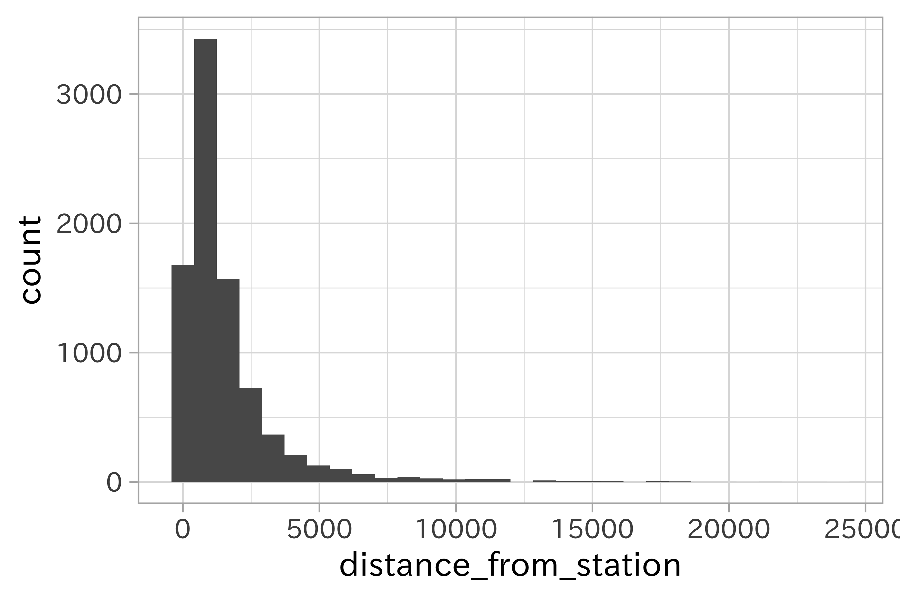
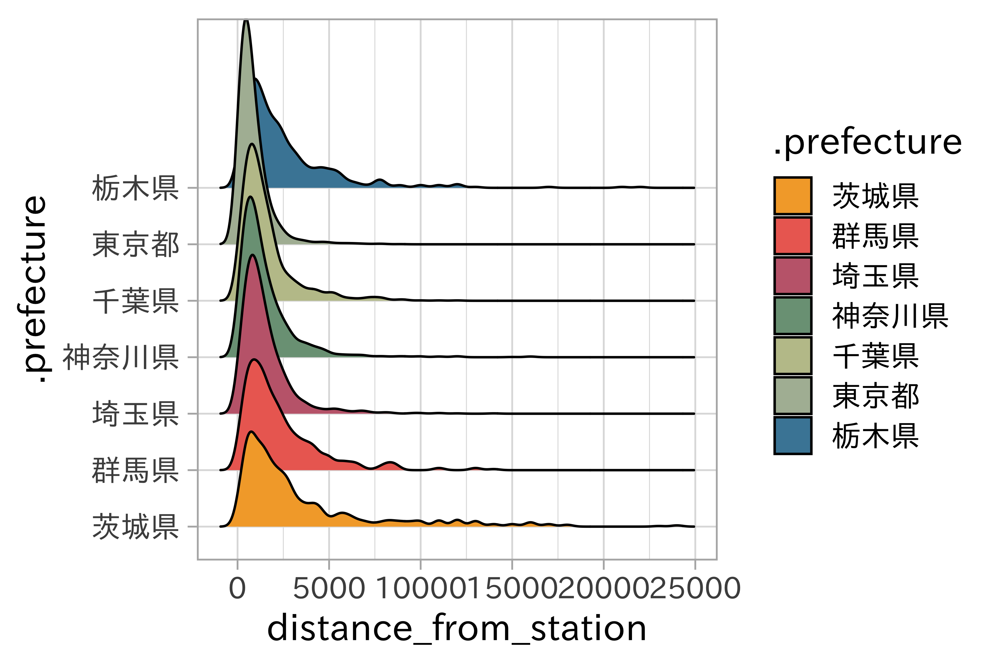
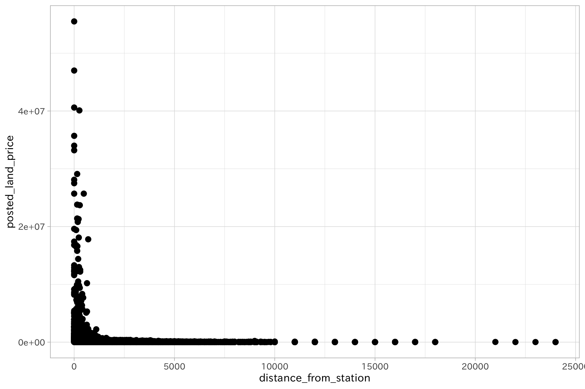
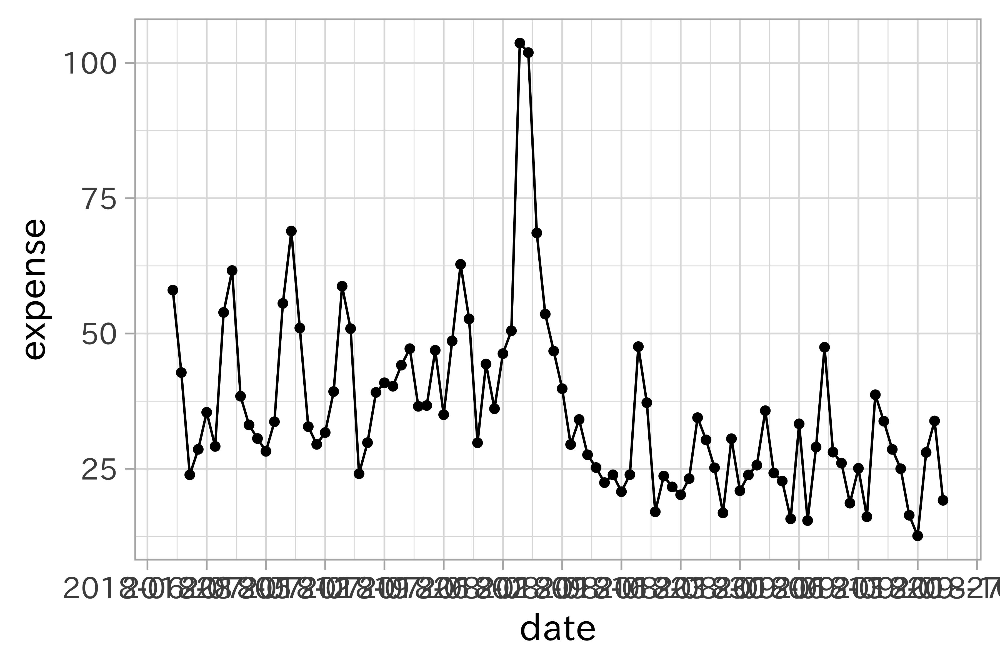
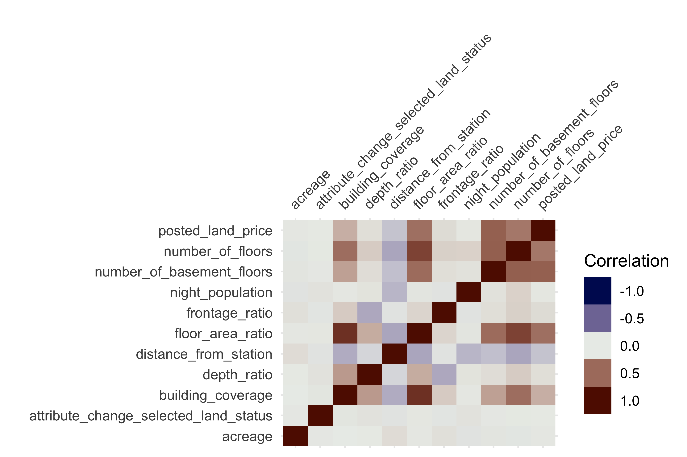

# 探索的データ分析

データを料理する前に、どのようなデータが与えられているのか確認することが大切です。この段階を踏むことで、データに対する理解が深まり、より良いモデルの構築に繋がる可能性もあります。こうした一連の作業は探索的データ分析
(Exploratory Data Analysis:
EDA)と呼ばれます。この作業には、データの集計、要約、可視化が含まれます。

EDAがデータ分析の作業において早期段階で行われるのは、データの異常（思い込みとの比較を含めて）や特徴を把握するためです。これらは分析全体のアプローチや良い出発点を見つけるために有効です。出発点と表現したのは、モデルの構築や特徴量の生成によって改めてデータを見つめ直す作業が発生するためです。そのため必ずしも徹底的である必要はありません。

まずは手元のデータを眺め、簡単な集計をしてみましょう。続いてデータをグラフによって表現してみましょう。データを要約、図示することで、個々の値からは見えなかった情報やデータ間の関係を把握できます。特に欠損値や異常値（外れ値）、データの分布などデータ全体あるいはデータ間の関係性やそのばらつきを見るのに可視化は重要です。なお欠損値の視覚化については[後の章](../03/handling-missing-data)で解説します。

## データを眺める

地価公示データを利用します。このデータでは、目的変数として設定する地価価格に影響を及ぼす変数を明らかにしたい、またその関係を知りたいという状況を設定します。

<!-- ここで扱うデータは地価公示データのみ。他のデータ、地価公示データの紹介は別のノート (`dataset/`)で。基本的に説明は地価公示データベース。データの性質に合わせて利用する。 -->

データを手に入れたら、分析作業へ取り掛かる前にまずはデータを眺めてみることにしましょう。眺める、と言ってもデータの値を1つずつ見ていくわけではありません。これから扱うデータにはどのような値が含まれているのか、データ型が処理されているか、また全体の大きさはどれくらいなのか欠損はどれだけあるかと言った情報を俯瞰的に整理していきます。それには以下のような項目があります。

  - サイズ（列数、行数）
  - 各列のデータ型
  - 完全データ、欠損データ

### データの大きさ

データフレームは行と列からなります。いくつかの関数を使って読み込んだデータの大きさを調べてみましょう。

{:.input_area}
```R
dim(df_lp_kanto)
```

    ## [1] 8476   45

`dim()`をデータフレームに適用すると、そのサイズを数値ベクトルで返します。最初の要素が行数、2番目の数字が列数を示します。これは次の`ncol()`、`nrow()`により個別に求めることができます。

{:.input_area}
```R
nrow(df_lp_kanto)
```

    ## [1] 8476

{:.input_area}
```R
ncol(df_lp_kanto)
```

    ## [1] 45

### データの一部を表示

データフレームの一部を表示して、列名と値の確認をしてみましょう。`head()`をデータフレームに対して実行すると先頭の数行を表示します。また`tail()`
でデータフレームの最後の行を表示できます。いずれの関数も引数`n =` に実数を与えることで表示される行数を制御可能です。

{:.input_area}
```R
head(df_lp_kanto)
```

    ## # A tibble: 6 x 45
    ##   .row_id .prefecture administrative_… posted_land_pri… name_of_nearest…
    ##     <int> <chr>       <chr>                       <int> <chr>           
    ## 1   13534 群馬県      10425                        4150 万座・鹿沢口    
    ## 2   13604 群馬県      10426                       39000 長野原草津口    
    ## 3   13605 群馬県      10426                       56800 長野原草津口    
    ## 4   13613 群馬県      10424                        2700 羽根尾          
    ## 5   13620 群馬県      10424                       12100 羽根尾          
    ## 6   13621 群馬県      10426                       29800 長野原草津口    
    ## # … with 40 more variables: distance_from_station <int>, acreage <int>,
    ## #   current_use <chr>, usage_description <chr>, building_structure <chr>,
    ## #   attribute_change_supplied_facility <lgl>, water_facility <lgl>,
    ## #   gas_facility <lgl>, sewage_facility <lgl>,
    ## #   proximity_with_transportation_facility <chr>, depth_ratio <dbl>,
    ## #   number_of_floors <int>, number_of_basement_floors <int>,
    ## #   use_district <chr>, building_coverage <dbl>, configuration <chr>,
    ## #   surrounding_present_usage <chr>, fire_area <chr>,
    ## #   urban_planning_area <chr>, forest_law <chr>, parks_law <chr>,
    ## #   attribute_change_floor_area_ratio <lgl>, frontage_ratio <dbl>,
    ## #   floor_area_ratio <dbl>, attribute_change_selected_land_status <dbl>,
    ## #   attribute_change_address <lgl>, attribute_change_acreage <lgl>,
    ## #   attribute_change_current_use <lgl>,
    ## #   attribute_change_building_structure <lgl>,
    ## #   attribute_change_distance_from_station <lgl>,
    ## #   attribute_change_use_district <lgl>, attribute_change_fire_area <lgl>,
    ## #   attribute_change_urban_planning_area <lgl>,
    ## #   attribute_change_forest_law <lgl>, attribute_change_parks_law <lgl>,
    ## #   attribute_change_building_coverage <lgl>,
    ## #   common_surveyed_position <lgl>, .longitude <dbl>, .latitude <dbl>,
    ## #   night_population <dbl>

{:.input_area}
```R
tail(df_lp_kanto, n = 3)
```

    ## # A tibble: 3 x 45
    ##   .row_id .prefecture administrative_… posted_land_pri… name_of_nearest…
    ##     <int> <chr>       <chr>                       <int> <chr>           
    ## 1   23818 茨城県      08232                       15600 銚子            
    ## 2   23839 千葉県      12202                       41200 銚子            
    ## 3   23851 千葉県      12202                       31500 銚子            
    ## # … with 40 more variables: distance_from_station <int>, acreage <int>,
    ## #   current_use <chr>, usage_description <chr>, building_structure <chr>,
    ## #   attribute_change_supplied_facility <lgl>, water_facility <lgl>,
    ## #   gas_facility <lgl>, sewage_facility <lgl>,
    ## #   proximity_with_transportation_facility <chr>, depth_ratio <dbl>,
    ## #   number_of_floors <int>, number_of_basement_floors <int>,
    ## #   use_district <chr>, building_coverage <dbl>, configuration <chr>,
    ## #   surrounding_present_usage <chr>, fire_area <chr>,
    ## #   urban_planning_area <chr>, forest_law <chr>, parks_law <chr>,
    ## #   attribute_change_floor_area_ratio <lgl>, frontage_ratio <dbl>,
    ## #   floor_area_ratio <dbl>, attribute_change_selected_land_status <dbl>,
    ## #   attribute_change_address <lgl>, attribute_change_acreage <lgl>,
    ## #   attribute_change_current_use <lgl>,
    ## #   attribute_change_building_structure <lgl>,
    ## #   attribute_change_distance_from_station <lgl>,
    ## #   attribute_change_use_district <lgl>, attribute_change_fire_area <lgl>,
    ## #   attribute_change_urban_planning_area <lgl>,
    ## #   attribute_change_forest_law <lgl>, attribute_change_parks_law <lgl>,
    ## #   attribute_change_building_coverage <lgl>,
    ## #   common_surveyed_position <lgl>, .longitude <dbl>, .latitude <dbl>,
    ## #   night_population <dbl>

### 各列の情報

データ型や件数、欠損の状況を調べます。

{:.input_area}
```R
glimpse(df_lp_kanto)
```

    ## Observations: 8,476
    ## Variables: 45
    ## $ .row_id                                <int> 13534, 13604, 13605, 136…
    ## $ .prefecture                            <chr> "群馬県", "群馬県", "群馬県", "群馬…
    ## $ administrative_area_code               <chr> "10425", "10426", "10426…
    ## $ posted_land_price                      <int> 4150, 39000, 56800, 2700…
    ## $ name_of_nearest_station                <chr> "万座・鹿沢口", "長野原草津口", "長野原…
    ## $ distance_from_station                  <int> 8700, 13000, 13000, 5500…
    ## $ acreage                                <int> 317, 166, 226, 274, 357,…
    ## $ current_use                            <chr> "住宅,その他", "住宅", "店舗", "住…
    ## $ usage_description                      <chr> "別荘", NA, NA, "別荘", NA, …
    ## $ building_structure                     <chr> "W1", "W2", "W1", "W2", …
    ## $ attribute_change_supplied_facility     <lgl> FALSE, FALSE, FALSE, FAL…
    ## $ water_facility                         <lgl> TRUE, TRUE, TRUE, TRUE, …
    ## $ gas_facility                           <lgl> FALSE, FALSE, FALSE, FAL…
    ## $ sewage_facility                        <lgl> FALSE, TRUE, TRUE, TRUE,…
    ## $ proximity_with_transportation_facility <chr> NA, NA, NA, NA, NA, NA, …
    ## $ depth_ratio                            <dbl> 1.0, 1.0, 2.0, 2.0, 1.5,…
    ## $ number_of_floors                       <int> 1, 2, 1, 2, 2, 2, 2, 1, …
    ## $ number_of_basement_floors              <int> 0, 0, 0, 0, 0, 0, 0, 0, …
    ## $ use_district                           <chr> NA, "2住居", "近商", NA, NA,…
    ## $ building_coverage                      <dbl> 0, 60, 80, 70, 70, 60, 7…
    ## $ configuration                          <chr> NA, NA, "台形", NA, NA, NA…
    ## $ surrounding_present_usage              <chr> "低層別荘が建ち並ぶ環境の良い別荘地域", "一…
    ## $ fire_area                              <chr> NA, NA, NA, NA, NA, NA, …
    ## $ urban_planning_area                    <chr> "都計外", "非線引", "非線引", "非線…
    ## $ forest_law                             <chr> NA, NA, NA, NA, NA, NA, …
    ## $ parks_law                              <chr> NA, NA, NA, NA, NA, NA, …
    ## $ attribute_change_floor_area_ratio      <lgl> FALSE, FALSE, FALSE, FAL…
    ## $ frontage_ratio                         <dbl> 1.2, 1.2, 1.0, 1.0, 1.0,…
    ## $ floor_area_ratio                       <dbl> 0, 200, 300, 400, 400, 2…
    ## $ attribute_change_selected_land_status  <dbl> 1, 1, 1, 1, 1, 1, 1, 1, …
    ## $ attribute_change_address               <lgl> FALSE, FALSE, FALSE, FAL…
    ## $ attribute_change_acreage               <lgl> FALSE, FALSE, FALSE, FAL…
    ## $ attribute_change_current_use           <lgl> FALSE, FALSE, FALSE, FAL…
    ## $ attribute_change_building_structure    <lgl> FALSE, FALSE, FALSE, FAL…
    ## $ attribute_change_distance_from_station <lgl> FALSE, FALSE, FALSE, FAL…
    ## $ attribute_change_use_district          <lgl> FALSE, FALSE, FALSE, FAL…
    ## $ attribute_change_fire_area             <lgl> FALSE, FALSE, FALSE, FAL…
    ## $ attribute_change_urban_planning_area   <lgl> FALSE, FALSE, FALSE, FAL…
    ## $ attribute_change_forest_law            <lgl> FALSE, FALSE, FALSE, FAL…
    ## $ attribute_change_parks_law             <lgl> FALSE, FALSE, FALSE, FAL…
    ## $ attribute_change_building_coverage     <lgl> FALSE, FALSE, FALSE, FAL…
    ## $ common_surveyed_position               <lgl> FALSE, FALSE, FALSE, FAL…
    ## $ .longitude                             <dbl> 138.5383, 138.5921, 138.…
    ## $ .latitude                              <dbl> 36.46920, 36.61913, 36.6…
    ## $ night_population                       <dbl> 9780, 6518, 6518, 5536, …

この地価公示データには45の列（変数）があります。

  - データの型 (`character`, `numeric`, `logical`,
    `factor`)

  - 欠損数、ユニーク数

  - 文字データの長さの幅

  - カテゴリデータの偏り、水準、順序

  - 数値データの要約統計量、分布（ヒストグラム）

  - `configuration`や`fire_area`は欠損を多く含んでいることがわかります。`building_structure`にもわずかですが欠損データがあります

<!-- end list -->

{:.input_area}
```R
# 同一のデータで重複があるもの
df_lp_kanto %>% 
  tidyr::separate_rows("current_use", sep = ",") %>% 
  count(.row_id) %>% 
  filter(n > 1) %>% 
  distinct(.row_id) %>% 
  nrow() %>% 
  ensure(. == 1986L)
```

    ## [1] 1986

明確な答えがあるわけではありませんが、以下の情報はデータ全体、各変数について把握しておくと良いでしょう。またデータの偏りや出現傾向、分布のパターンは可視化を行い確認するのが効率的です。

## 要約統計量の算出

{:.input_area}
```R
summary(df_lp_kanto)
```

    ##     .row_id      .prefecture        administrative_area_code
    ##  Min.   :13534   Length:8476        Length:8476             
    ##  1st Qu.:16404   Class :character   Class :character        
    ##  Median :18532   Mode  :character   Mode  :character        
    ##  Mean   :18584                                              
    ##  3rd Qu.:20708                                              
    ##  Max.   :23851                                              
    ##  posted_land_price  name_of_nearest_station distance_from_station
    ##  Min.   :     613   Length:8476             Min.   :    0        
    ##  1st Qu.:   59900   Class :character        1st Qu.:  500        
    ##  Median :  155000   Mode  :character        Median : 1000        
    ##  Mean   :  415432                           Mean   : 1566        
    ##  3rd Qu.:  308000                           3rd Qu.: 1800        
    ##  Max.   :55500000                           Max.   :24000        
    ##     acreage       current_use        usage_description  building_structure
    ##  Min.   :    46   Length:8476        Length:8476        Length:8476       
    ##  1st Qu.:   140   Class :character   Class :character   Class :character  
    ##  Median :   181   Mode  :character   Mode  :character   Mode  :character  
    ##  Mean   :   751                                                           
    ##  3rd Qu.:   272                                                           
    ##  Max.   :413215                                                           
    ##  attribute_change_supplied_facility water_facility  gas_facility   
    ##  Mode :logical                      Mode :logical   Mode :logical  
    ##  FALSE:8429                         FALSE:49        FALSE:1860     
    ##  TRUE :47                           TRUE :8427      TRUE :6616     
    ##                                                                    
    ##                                                                    
    ##                                                                    
    ##  sewage_facility proximity_with_transportation_facility  depth_ratio   
    ##  Mode :logical   Length:8476                            Min.   :0.000  
    ##  FALSE:701       Class :character                       1st Qu.:1.000  
    ##  TRUE :7775      Mode  :character                       Median :1.200  
    ##                                                         Mean   :1.459  
    ##                                                         3rd Qu.:1.500  
    ##                                                         Max.   :6.500  
    ##  number_of_floors number_of_basement_floors use_district      
    ##  Min.   : 0.000   Min.   :0.00000           Length:8476       
    ##  1st Qu.: 2.000   1st Qu.:0.00000           Class :character  
    ##  Median : 2.000   Median :0.00000           Mode  :character  
    ##  Mean   : 2.718   Mean   :0.07574                             
    ##  3rd Qu.: 2.000   3rd Qu.:0.00000                             
    ##  Max.   :52.000   Max.   :6.00000                             
    ##  building_coverage configuration      surrounding_present_usage
    ##  Min.   : 0.00     Length:8476        Length:8476              
    ##  1st Qu.:50.00     Class :character   Class :character         
    ##  Median :60.00     Mode  :character   Mode  :character         
    ##  Mean   :60.17                                                 
    ##  3rd Qu.:60.00                                                 
    ##  Max.   :80.00                                                 
    ##   fire_area         urban_planning_area  forest_law       
    ##  Length:8476        Length:8476         Length:8476       
    ##  Class :character   Class :character    Class :character  
    ##  Mode  :character   Mode  :character    Mode  :character  
    ##                                                           
    ##                                                           
    ##                                                           
    ##   parks_law         attribute_change_floor_area_ratio frontage_ratio 
    ##  Length:8476        Mode :logical                     Min.   :0.000  
    ##  Class :character   FALSE:8474                        1st Qu.:1.000  
    ##  Mode  :character   TRUE :2                           Median :1.000  
    ##                                                       Mean   :1.066  
    ##                                                       3rd Qu.:1.000  
    ##                                                       Max.   :5.500  
    ##  floor_area_ratio attribute_change_selected_land_status
    ##  Min.   :   0.0   Min.   :1.000                        
    ##  1st Qu.: 100.0   1st Qu.:1.000                        
    ##  Median : 200.0   Median :1.000                        
    ##  Mean   : 216.6   Mean   :1.027                        
    ##  3rd Qu.: 200.0   3rd Qu.:1.000                        
    ##  Max.   :1300.0   Max.   :4.000                        
    ##  attribute_change_address attribute_change_acreage
    ##  Mode :logical            Mode :logical           
    ##  FALSE:8411               FALSE:8450              
    ##  TRUE :65                 TRUE :26                
    ##                                                   
    ##                                                   
    ##                                                   
    ##  attribute_change_current_use attribute_change_building_structure
    ##  Mode :logical                Mode :logical                      
    ##  FALSE:8402                   FALSE:8406                         
    ##  TRUE :74                     TRUE :70                           
    ##                                                                  
    ##                                                                  
    ##                                                                  
    ##  attribute_change_distance_from_station attribute_change_use_district
    ##  Mode :logical                          Mode :logical                
    ##  FALSE:8431                             FALSE:8475                   
    ##  TRUE :45                               TRUE :1                      
    ##                                                                      
    ##                                                                      
    ##                                                                      
    ##  attribute_change_fire_area attribute_change_urban_planning_area
    ##  Mode :logical              Mode :logical                       
    ##  FALSE:8417                 FALSE:8475                          
    ##  TRUE :59                   TRUE :1                             
    ##                                                                 
    ##                                                                 
    ##                                                                 
    ##  attribute_change_forest_law attribute_change_parks_law
    ##  Mode :logical               Mode :logical             
    ##  FALSE:8476                  FALSE:8476                
    ##                                                        
    ##                                                        
    ##                                                        
    ##                                                        
    ##  attribute_change_building_coverage common_surveyed_position
    ##  Mode :logical                      Mode :logical           
    ##  FALSE:8474                         FALSE:7870              
    ##  TRUE :2                            TRUE :606               
    ##                                                             
    ##                                                             
    ##                                                             
    ##    .longitude      .latitude     night_population
    ##  Min.   :138.5   Min.   :34.98   Min.   :  3214  
    ##  1st Qu.:139.5   1st Qu.:35.59   1st Qu.:118919  
    ##  Median :139.7   Median :35.72   Median :200012  
    ##  Mean   :139.7   Mean   :35.79   Mean   :259450  
    ##  3rd Qu.:139.9   3rd Qu.:35.92   3rd Qu.:341076  
    ##  Max.   :140.8   Max.   :37.02   Max.   :903346

Rの組み込み関数として用意されている `summary()` を利用して、データフレームに含まれる列の要約統計量を得ることができます。

{:.input_area}
```R
# 論理値型で標準偏差0の列を特定 constant cols
df_lp_kanto %>% 
  select(-starts_with(".")) %>% 
  select_if(is.logical) %>% 
  mutate_all(as.numeric) %>% 
  summarise_all(sd) %>% 
  tidyr::gather()
```

    ## # A tibble: 17 x 2
    ##    key                                     value
    ##    <chr>                                   <dbl>
    ##  1 attribute_change_supplied_facility     0.0743
    ##  2 water_facility                         0.0758
    ##  3 gas_facility                           0.414 
    ##  4 sewage_facility                        0.275 
    ##  5 attribute_change_floor_area_ratio      0.0154
    ##  6 attribute_change_address               0.0872
    ##  7 attribute_change_acreage               0.0553
    ##  8 attribute_change_current_use           0.0930
    ##  9 attribute_change_building_structure    0.0905
    ## 10 attribute_change_distance_from_station 0.0727
    ## 11 attribute_change_use_district          0.0109
    ## 12 attribute_change_fire_area             0.0831
    ## 13 attribute_change_urban_planning_area   0.0109
    ## 14 attribute_change_forest_law            0     
    ## 15 attribute_change_parks_law             0     
    ## 16 attribute_change_building_coverage     0.0154
    ## 17 common_surveyed_position               0.258

ここでは `skimr` で行う例を示します。

{:.input_area}
```R
# skimr::skim(df_lp) # Rコンソールでの実行は skim() で構いません
df_lp_kanto %>% 
  select(-starts_with(".")) %>% 
  skimr::skim_to_list()
```

    ## $character
    ## # A tibble: 13 x 8
    ##    variable               missing complete n     min   max   empty n_unique
    ##  * <chr>                  <chr>   <chr>    <chr> <chr> <chr> <chr> <chr>   
    ##  1 administrative_area_c… 0       8476     8476  5     5     0     329     
    ##  2 building_structure     220     8256     8476  2     8     0     130     
    ##  3 configuration          7454    1022     8476  2     3     0     2       
    ##  4 current_use            0       8476     8476  2     14    0     70      
    ##  5 fire_area              4859    3617     8476  2     2     0     2       
    ##  6 forest_law             8450    26       8476  3     3     0     1       
    ##  7 name_of_nearest_stati… 0       8476     8476  1     14    0     1481    
    ##  8 parks_law              8465    11       8476  7     7     0     2       
    ##  9 proximity_with_transp… 8308    168      8476  2     6     0     3       
    ## 10 surrounding_present_u… 0       8476     8476  15    22    0     4397    
    ## 11 urban_planning_area    0       8476     8476  2     3     0     4       
    ## 12 usage_description      7552    924      8476  1     8     0     40      
    ## 13 use_district           515     7961     8476  2     3     0     12      
    ## 
    ## $integer
    ## # A tibble: 5 x 12
    ##   variable missing complete n     mean  sd    p0    p25   p50   p75   p100 
    ## * <chr>    <chr>   <chr>    <chr> <chr> <chr> <chr> <chr> <chr> <chr> <chr>
    ## 1 acreage  0       8476     8476  "   … "   … 46    140   181   272   "413…
    ## 2 distanc… 0       8476     8476  "  1… "   … 0     500   1000  1800  " 24…
    ## 3 number_… 0       8476     8476  "   … "   … 0     0     0     0     "   …
    ## 4 number_… 0       8476     8476  "   … "   … 0     2     2     2     "   …
    ## 5 posted_… 0       8476     8476  "415… 1766… 613   59900 1550… 3080… "   …
    ## # … with 1 more variable: hist <chr>
    ## 
    ## $logical
    ## # A tibble: 17 x 6
    ##    variable                 missing complete n     mean    count           
    ##  * <chr>                    <chr>   <chr>    <chr> <chr>   <chr>           
    ##  1 attribute_change_acreage 0       8476     8476  "0.003… FAL: 8450, TRU:…
    ##  2 attribute_change_address 0       8476     8476  "0.007… FAL: 8411, TRU:…
    ##  3 attribute_change_buildi… 0       8476     8476  0.00024 FAL: 8474, TRU:…
    ##  4 attribute_change_buildi… 0       8476     8476  "0.008… FAL: 8406, TRU:…
    ##  5 attribute_change_curren… 0       8476     8476  "0.008… FAL: 8402, TRU:…
    ##  6 attribute_change_distan… 0       8476     8476  "0.005… FAL: 8431, TRU:…
    ##  7 attribute_change_fire_a… 0       8476     8476  "0.007… FAL: 8417, TRU:…
    ##  8 attribute_change_floor_… 0       8476     8476  0.00024 FAL: 8474, TRU:…
    ##  9 attribute_change_forest… 0       8476     8476  "0    … FAL: 8476, NA: 0
    ## 10 attribute_change_parks_… 0       8476     8476  "0    … FAL: 8476, NA: 0
    ## 11 attribute_change_suppli… 0       8476     8476  "0.005… FAL: 8429, TRU:…
    ## 12 attribute_change_urban_… 0       8476     8476  0.00012 FAL: 8475, TRU:…
    ## 13 attribute_change_use_di… 0       8476     8476  0.00012 FAL: 8475, TRU:…
    ## 14 common_surveyed_position 0       8476     8476  "0.071… FAL: 7870, TRU:…
    ## 15 gas_facility             0       8476     8476  "0.78 … TRU: 6616, FAL:…
    ## 16 sewage_facility          0       8476     8476  "0.92 … TRU: 7775, FAL:…
    ## 17 water_facility           0       8476     8476  "0.99 … TRU: 8427, FAL:…
    ## 
    ## $numeric
    ## # A tibble: 6 x 12
    ##   variable missing complete n     mean  sd    p0    p25   p50   p75   p100 
    ## * <chr>    <chr>   <chr>    <chr> <chr> <chr> <chr> <chr> <chr> <chr> <chr>
    ## 1 attribu… 0       8476     8476  "   … "   … 1     1     "   … "   … "   …
    ## 2 buildin… 0       8476     8476  "   … "   … 0     50    "   … "   … "   …
    ## 3 depth_r… 0       8476     8476  "   … "   … 0     1     "   … "   … "   …
    ## 4 floor_a… 0       8476     8476  "   … "  1… 0     100   "  2… "   … " 13…
    ## 5 frontag… 0       8476     8476  "   … "   … 0     1     "   … "   … "   …
    ## 6 night_p… 0       8476     8476  2594… "2e+… 3214  1189… "2e+… "341… "9e+…
    ## # … with 1 more variable: hist <chr>

論理型データのうち、`attribute_change_forest_law` と `attribute_change_parks_law` は
FALSE
のみが出現していることがわかります。

## 探索的データ分析

モデリングでは、目的変数の挙動（予測、分類）を明らかにすることがゴールとして設定されます。変数が多いデータであるほど確認する図の数が多くなり、効率的ではなくなります。そのため、まずはモデリングの目的変数となるデータを詳しく見ることを勧めます。また、この段階で作る図は初期モデルを構築する前段階で示唆を提供するものであると望ましいです。そこで目的変数に影響する説明変数、説明変数間の関係を明らかにすることで、次のモデリングプロセスに活かせる知識を得られることが期待できます。

探索的データ分析の結果が最終的な成果物になることは稀です。ここで作られる図は論文や書籍、プレゼンテーションのための図ではありません。つまり複雑な図を作ることは求められていません。ここでは主にggplot2による作図を行いますが、扱いに慣れた最低限の機能を提供しれくれるライブラリを利用すると良いでしょう。

以下では引き続き、地価公示データを使います。このデータには位置情報も含まれているため、地図上へのデータのマッピングも試みます。

また時系列データの例としてビールへの支出データも利用します。

## 数値データ

{:.input_area}
```R
df_is_num <- 
  df_lp_kanto %>% 
  select(-starts_with(".")) %>% 
  select_if(is_numeric)
```

## カテゴリデータ

{:.input_area}
```R
df_is_cat <- 
  df_lp_kanto %>% 
  select(-starts_with(".")) %>% 
  select_if(is.character) %>% 
  verify(ncol(.) == 13)
```

{:.input_area}
```R
df_is_cat %>% 
  count(name_of_nearest_station, sort = TRUE)
```

    ## # A tibble: 1,481 x 2
    ##    name_of_nearest_station     n
    ##    <chr>                   <int>
    ##  1 本厚木                     59
    ##  2 水戸                       56
    ##  3 宇都宮                     55
    ##  4 平塚                       51
    ##  5 八王子                     48
    ##  6 柏                         41
    ##  7 川崎                       40
    ##  8 木更津                     36
    ##  9 千葉                       35
    ## 10 前橋                       34
    ## # … with 1,471 more rows

## 論理値

{:.input_area}
```R
df_is_log <-
  df_lp_kanto %>% 
  select(-starts_with(".")) %>% 
  select_if(is.logical) %>% 
  verify(ncol(.) == 17)
```

{:.input_area}
```R
gg_count_var <- function(data, var) {
  var <- rlang::enquo(var)
  var_label <- rlang::quo_name(var)
    data %>% 
    count(!!var) %>% 
    ggplot(aes(forcats::fct_reorder(!!var, n), n)) +
    geom_bar(stat = "identity") +
    labs(x = var_label) +
    coord_flip()
}
```

{:.input_area}
```R
df_is_cat %>% 
  filter(stringr::str_detect(administrative_area_code, "^08")) %>% 
  gg_count_var(name_of_nearest_station)
```


{:.input_area}
```R
purrr::map(
  rlang::syms(str_subset(names(df_is_cat), "name_of_nearest_station", negate = TRUE)),
  ~ gg_count_var(df_is_cat %>% 
                   filter(stringr::str_detect(administrative_area_code, "^08")), 
                 !!.x)) %>% 
    plot_grid(plotlist = ., ncol = 2)
```


何枚かの図は文字が潰れてしまいましたが、いくつかのカテゴリデータについて掴めたことがあります。

### 全体

{:.input_area}
```R
vis_dat(df_lp_kanto)
```

### 1変数の可視化

データのばらつきを見るのにはヒストグラム、箱ひげ図を利用します。一変量を対象とした単純な可視化は、変数の変動、特性を理解するのに役立ちます。

#### ヒストグラム

スパイク（峰）を検出するのに効果的です。ヒストグラムは単峰、二峰など多様な形状を取り得ます。

{:.input_area}
```R
df_lp_kanto %>% 
  ggplot(aes(distance_from_station)) +
  geom_histogram(bins = 30)
```



<!-- box-cox変換をする図をあとで -->

{:.input_area}
```R
df_lp_kanto %>% 
  ggplot(aes(distance_from_station)) +
  geom_histogram(bins = 30) +
  facet_wrap(~ .prefecture, ncol = 1)
```

{:.input_area}
```R
library(ggridges)

ggplot(df_lp_kanto, 
       aes(x = distance_from_station, y  = .prefecture,
           fill = .prefecture)) +
  #scale_x_log10() +
  ggridges::geom_density_ridges(scale = 4) +
  scale_fill_ds()
```



#### 箱ひげ図・バイオリンプロット

### 2変数の可視化

{:.input_area}
```R
df_lp_kanto %>% 
  ggplot(aes(use_district, posted_land_price)) +
  geom_boxplot()
```

#### 散布図

{:.input_area}
```R
df_lp_kanto %>% 
  ggplot(aes(distance_from_station, posted_land_price)) +
  geom_point()
```



{:.input_area}
```R
df_lp_kanto %>% 
  ggplot(aes(distance_from_station, acreage)) +
  geom_point() +
  scale_x_log10() +
  scale_y_log10()
```


## 特殊なデータの視覚化

### 時系列データ

時系列データを扱うときは、時間のならびの通りに表示させることが肝心です。周期があるものは分割したり重ねてみると良いでしょう。



{:.input_area}
```R
df_beer2018q2 %>% 
  ggplot(aes(expense)) +
  geom_histogram(bins = 30)
```

### 空間データ

{:.input_area}
```R
sf_lp_kanto <- 
  df_lp_kanto %>% 
  select(posted_land_price, .longitude, .latitude) %>% 
  st_as_sf(coords = c(".longitude", ".latitude"), crs = 4326)

ggplot(sf_lp_kanto) +
  geom_sf(aes(color = posted_land_price),
          fill = "transparent", 
          alpha = 0.1, size = 0.5) +
  scale_color_viridis_c()
```

<!-- アンスコムの例 -->

### 高次元の可視化

3次元の世界に生きる我々は、高次元のデータを直接扱うことに慣れていません。

次元圧縮を行ってからの可視化が効果的です。

#### ヒートマップ

変数間の関係、特に相関や欠損関係がある場合に役立ちます。

#### 散布図行列

{:.input_area}
```R
df_is_num %>% 
  GGally::ggpairs()
```

#### 相関行列

{:.input_area}
```R
df_is_num %>% 
  corrr::correlate()
```

    ## 
    ## Correlation method: 'pearson'
    ## Missing treated using: 'pairwise.complete.obs'

    ## # A tibble: 11 x 12
    ##    rowname posted_land_pri… distance_from_s…  acreage depth_ratio
    ##    <chr>              <dbl>            <dbl>    <dbl>       <dbl>
    ##  1 posted…         NA                -0.126   0.00819     0.0375 
    ##  2 distan…         -0.126            NA       0.0468     -0.0646 
    ##  3 acreage          0.00819           0.0468 NA           0.00383
    ##  4 depth_…          0.0375           -0.0646  0.00383    NA      
    ##  5 number…          0.438            -0.228  -0.0135      0.102  
    ##  6 number…          0.543            -0.138   0.0164      0.0428 
    ##  7 buildi…          0.212            -0.206  -0.00184     0.294  
    ##  8 fronta…          0.0486           -0.0185  0.0330     -0.220  
    ##  9 floor_…          0.473            -0.228   0.00763     0.223  
    ## 10 attrib…          0.00416          -0.0201 -0.00616     0.0244 
    ## 11 night_…          0.0103           -0.172  -0.0202      0.0211 
    ## # … with 7 more variables: number_of_floors <dbl>,
    ## #   number_of_basement_floors <dbl>, building_coverage <dbl>,
    ## #   frontage_ratio <dbl>, floor_area_ratio <dbl>,
    ## #   attribute_change_selected_land_status <dbl>, night_population <dbl>



{:.input_area}
```R
df_is_log %>% 
  mutate_all(as.numeric) %>% 
  vis_cor()

all.equal(
  df_lp_kanto$attribute_change_building_coverage,
  df_lp_kanto$attribute_change_floor_area_ratio)
```

#### t-SNE

高次元データの2次元散布図を用いた可視化に利用される

#### モデルの利用

効果的な変数の仮説がない場合や、変数の量が多い場合には、EDAの前に木ベースのモデルを適用してみるのも戦略の1つです。これらのモデルでは目的変数に対する説明変数の貢献度として、変数重要度を示すことが可能です。これによりEDAのとっかかりを得ることが可能になるはずです。変数重要度については後の章で解説します。

## まとめ

  - モデリング、統計分析を行う前にデータを精査することが大事
      - データの特徴を理解することで次のステップにかける時間を減らす、異常を見逃さない、（意図しない）間違いを見逃さない
  - 特に可視化の手法を用いることでデータの集約や関係、パターンを見やすくする

## 関連項目

  - [次元削減](../03/dimension-reduction)
  - [欠損処理](../03/handling-missing-data)
  - [変数重要度](../03/feature-selection)

## 参考文献

  -
