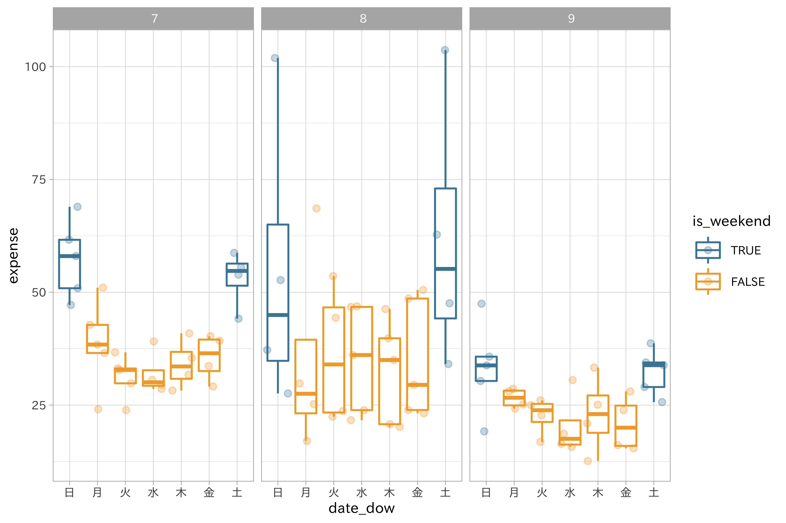
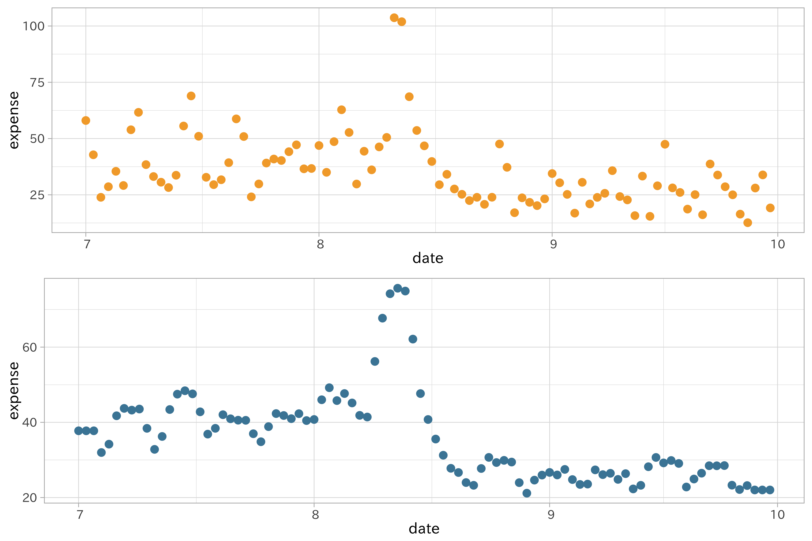
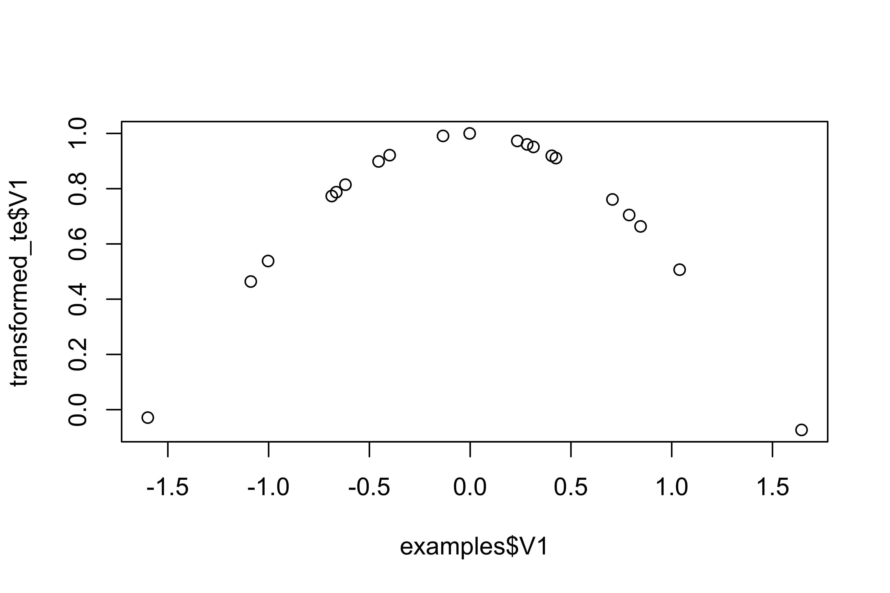

{:.input_area}
```R
library(lubridate)
```

# 日付・時間データの取り扱い

日付や時間の要素をもつデータは、

データ分析、機械学習のモデルにおいて時系列を示すデータ自体が入力や出力になることはありません。代わりに、

時系列データを構成する要素の特徴量エンジニアリングで生成される値を利用することになります。

日付・時間データに対する特徴量エンジニアリングの基本方針は以下の3点です。

  - 日付・時間データの特徴量… 日付・時間データ自身を構成する要素から特徴量を生成します
  - ラグ特徴量… 特定の時間をもとに、そこからの経過時間を扱います
  - 窓枠特徴量…
固定された期間に含まれる値を要約します

ここでは、日付・時間データが記録されているビールへの支出データを利用します。具体的な特徴量エンジニアリングの手法を紹介する前に、ビールの売り上げに対して、日付・時間データの何が効いているか、また、どのような状況が想定されるか仮説を立ててみましょう。思いつくものとして次の要因があります。

  - 平日・休日 -より厳密には週末かそうでないか… 土日は効果がありそうだ
      - 連休の数…
長すぎると売り上げが伸びなくなるのではないか
  - 夏休みにはどのような挙動を示すだろうか
  - 関係しそうではないもの
      - 月初や月末という効果は売り上げには貢献しないだろう（週ごとの影響はない）

このような仮説を検証できるよう、日付・時間に関する特徴量を生成していきます。

## 日付・時間データ自体を特徴量とする

日付、時間に関するデータからは多くの特徴量が生成できます。

### 要素の分解

日付や時間のデータは複数の要素で構成されます。例えば「2019年7月10日」であれば、年月日をそれぞれ分けて2019、7、10に分解可能です。これに時間が加わればさらに時分秒の要素に分解することもできます。

{:.input_area}
```R
mod_fml <- formula(expense ~ date + weatherdaytime_06_00_18_00)
```

{:.input_area}
```R
df_baked_split_date <- 
  df_beer2018q2 %>% 
  recipe(mod_fml) %>% 
  step_date(date) %>% 
  prep() %>% 
  juice()
```

    ## Warning: All elements of `...` must be named.
    ## Did you want `data = c(type, role, source)`?
    
    ## Warning: All elements of `...` must be named.
    ## Did you want `data = c(type, role, source)`?

{:.input_area}
```R
glimpse(df_baked_split_date)
```

    ## Observations: 92
    ## Variables: 6
    ## $ date                       <date> 2018-07-01, 2018-07-02, 2018-07-03,…
    ## $ weatherdaytime_06_00_18_00 <fct> 晴, 快晴, 薄曇, 曇一時雨, 雨後一時曇, 雨後時々曇, 曇, 薄曇…
    ## $ expense                    <dbl> 58.02, 42.79, 23.89, 28.60, 35.44, 2…
    ## $ date_dow                   <fct> 日, 月, 火, 水, 木, 金, 土, 日, 月, 火, 水, 木, …
    ## $ date_month                 <fct>  7,  7,  7,  7,  7,  7,  7,  7,  7, …
    ## $ date_year                  <dbl> 2018, 2018, 2018, 2018, 2018, 2018, …

日付もそれほど重要ではなさそうです。むしろ日付によって変わる平日・休日の違いが影響しそうですが、これについてはあとで処理を加えていくことにします。

期間が1年しかない場合、年の特徴量は情報がなくなり、モデルからは除外可能です。

ビールの売り上げを考えたとき、大事な日付の要素は何でしょうか。

ということがない限り、年の影響は小さそうです。小さなデータセットでは一年分しかない場合もあります（分散0）。

ビールの支出データに記録されている日付の曜日をダミーコーディングする例を考えてみましょう。曜日は7つの値を取りますが、コントラスト関数は6つのダミー変数で曜日を表現することになります。

6列… 該当する曜日で1, そうでない場合に0

まずは年月日からなる日付の変数から曜日を取り出す必要があります。

日付を記録するdate列の要素が分解され、新たな特徴量として追加されました。それでは曜日のダミーコーディングを実行します。

{:.input_area}
```R
df_baked_split_date %>% 
  recipe(expense ~ .) %>% 
  step_dummy(date_dow) %>% 
  prep(training = df_baked_split_date) %>% 
  bake(new_data = df_baked_split_date) %>% 
  select(starts_with("date_dow"), everything())
```

    ## Warning: All elements of `...` must be named.
    ## Did you want `data = c(type, role, source)`?
    
    ## Warning: All elements of `...` must be named.
    ## Did you want `data = c(type, role, source)`?

    ## # A tibble: 92 x 11
    ##    date_dow_月 date_dow_火 date_dow_水 date_dow_木 date_dow_金 date_dow_土
    ##          <dbl>       <dbl>       <dbl>       <dbl>       <dbl>       <dbl>
    ##  1           0           0           0           0           0           0
    ##  2           1           0           0           0           0           0
    ##  3           0           1           0           0           0           0
    ##  4           0           0           1           0           0           0
    ##  5           0           0           0           1           0           0
    ##  6           0           0           0           0           1           0
    ##  7           0           0           0           0           0           1
    ##  8           0           0           0           0           0           0
    ##  9           1           0           0           0           0           0
    ## 10           0           1           0           0           0           0
    ## # … with 82 more rows, and 5 more variables: date <date>,
    ## #   weatherdaytime_06_00_18_00 <fct>, expense <dbl>, date_month <fct>,
    ## #   date_year <dbl>

{:.input_area}
```R
rep_split_date <- 
  df_beer2018q2 %>% 
  recipe(expense ~ .) %>% 
  step_date(date)

df_beer_prep <- 
  rep_split_date %>% 
  prep(training = df_beer2018q2) %>% 
  juice(expense, starts_with("date"), temperature_average)
```

    ## Warning: All elements of `...` must be named.
    ## Did you want `data = c(type, role, source)`?
    
    ## Warning: All elements of `...` must be named.
    ## Did you want `data = c(type, role, source)`?

{:.input_area}
```R
df_beer_prep
```

    ## # A tibble: 92 x 6
    ##    date       temperature_average expense date_dow date_month date_year
    ##    <date>                   <dbl>   <dbl> <fct>    <fct>          <dbl>
    ##  1 2018-07-01                28.1    58.0 日       " 7"            2018
    ##  2 2018-07-02                28.8    42.8 月       " 7"            2018
    ##  3 2018-07-03                28.4    23.9 火       " 7"            2018
    ##  4 2018-07-04                27.6    28.6 水       " 7"            2018
    ##  5 2018-07-05                26.7    35.4 木       " 7"            2018
    ##  6 2018-07-06                21.7    29.1 金       " 7"            2018
    ##  7 2018-07-07                25      53.9 土       " 7"            2018
    ##  8 2018-07-08                27.4    61.6 日       " 7"            2018
    ##  9 2018-07-09                27.3    38.4 月       " 7"            2018
    ## 10 2018-07-10                28.5    33.1 火       " 7"            2018
    ## # … with 82 more rows

{:.input_area}
```R
# 日本の祝日判定に次の項目が利用可能
stringr::str_subset(timeDate::listHolidays(), "^JP")
```

    ##  [1] "JPAutumnalEquinox"      "JPBankHolidayDec31"    
    ##  [3] "JPBankHolidayJan2"      "JPBankHolidayJan3"     
    ##  [5] "JPBunkaNoHi"            "JPChildrensDay"        
    ##  [7] "JPComingOfAgeDay"       "JPConstitutionDay"     
    ##  [9] "JPEmperorsBirthday"     "JPGantan"              
    ## [11] "JPGreeneryDay"          "JPHealthandSportsDay"  
    ## [13] "JPKeirouNOhi"           "JPKenkokuKinenNoHi"    
    ## [15] "JPKenpouKinenBi"        "JPKinrouKanshaNoHi"    
    ## [17] "JPKodomoNoHi"           "JPKokuminNoKyujitu"    
    ## [19] "JPMarineDay"            "JPMidoriNoHi"          
    ## [21] "JPNatFoundationDay"     "JPNationalCultureDay"  
    ## [23] "JPNationHoliday"        "JPNewYearsDay"         
    ## [25] "JPRespectForTheAgedDay" "JPSeijinNoHi"          
    ## [27] "JPShuubunNoHi"          "JPTaiikuNoHi"          
    ## [29] "JPTennouTanjyouBi"      "JPThanksgivingDay"     
    ## [31] "JPUmiNoHi"

## カレンダー（祝日）

人の行動による影響を受けるデータでは、日付の平日・休日を区別することが重要になることが多いです。それは平日と休日では人々の行動様式が異なると考えられるためです。一方で自然活動を扱うデータではこの要素が影響するとは考えられません。ビールの支出データは人間活動を直接記録したものですので、その区別を行っておくことは大事でしょう。ここでは夏場のビールの支出データを対象に平日・休日を分ける特徴量を作ろうと思います。

まず、土日とその他の曜日を分けるフラグを作ります。これは曜日がわかる特徴量があれば簡単に区別可能です。

今度は分解した曜日の情報をもとに、ビールの売り上げは「翌日に仕事が控えている曜日よりも休日の方が増えそうだ」という直感を調べてみましょう。

{:.input_area}
```R
df_baked_split_date <- 
  df_baked_split_date %>% 
  mutate(is_weekend = if_else(date_dow %in% c("土", "日"),
                              TRUE,
                              FALSE))
```

{:.input_area}
```R
df_baked_split_date %>% 
  ggplot(aes(date_dow, expense)) +
  geom_boxplot(aes(color = is_weekend), outlier.shape = NA) +
  geom_jitter(aes(color = is_weekend), alpha = 0.3) +
  scale_color_ds() +
  guides(col = guide_legend(reverse = TRUE)) +
  facet_wrap(~ date_month)
```



目論見通り、どの月でも平日よりも休日の方が支出が増えているようです。また、8月は週ごとに変動が大きく、9月では平日との差がほとんどないということもグラフから読み取れます。新たな特徴量の作成と関係の図示により、経験的な推論を確認するだけでなく、モデルに対する新たな洞察も得ることができました。

7月から9月にかけては

  - 海の日（7月第3月曜日）
  - 山の日 (8月11日) … 2016年に設立。
  - 敬老の日 (9月第3月曜日)
  - 秋分の日 (秋分日…
)

が祝日となります。また、この期間で考慮すべき日付として「お盆」の期間があります。多くの企業でこの期間は夏休みとなっていると考えられます。8月13日から15日のデータも他の日付と区別できるようにしておきます。

{:.input_area}
```R
df_beer_prep <- 
  df_beer_prep %>% 
  recipe(expense ~ .) %>% 
  step_holiday(date,
               holidays = timeDate::listHolidays("JP") %>% 
                 str_subset("UmiNoHi|KeirouNOhi|ShuubunNoHi")) %>% 
  prep() %>% 
  bake(new_data = df_beer_prep) %>%
  # timeDate::listHolidays() が山の日に未対応なのでフラグを作る処理を用意する
  mutate(date_JPYamaNoHi = as.numeric(date == ymd("2018-08-11")),
         is_obon = between(date, ymd("2018-08-13"), ymd("2018-08-15")))
```

    ## Warning: All elements of `...` must be named.
    ## Did you want `data = c(type, role, source)`?
    
    ## Warning: All elements of `...` must be named.
    ## Did you want `data = c(type, role, source)`?

{:.input_area}
```R
df_beer_prep
```

    ## # A tibble: 92 x 11
    ##    date       temperature_ave… expense date_dow date_month date_year
    ##    <date>                <dbl>   <dbl> <fct>    <fct>          <dbl>
    ##  1 2018-07-01             28.1    58.0 日       " 7"            2018
    ##  2 2018-07-02             28.8    42.8 月       " 7"            2018
    ##  3 2018-07-03             28.4    23.9 火       " 7"            2018
    ##  4 2018-07-04             27.6    28.6 水       " 7"            2018
    ##  5 2018-07-05             26.7    35.4 木       " 7"            2018
    ##  6 2018-07-06             21.7    29.1 金       " 7"            2018
    ##  7 2018-07-07             25      53.9 土       " 7"            2018
    ##  8 2018-07-08             27.4    61.6 日       " 7"            2018
    ##  9 2018-07-09             27.3    38.4 月       " 7"            2018
    ## 10 2018-07-10             28.5    33.1 火       " 7"            2018
    ## # … with 82 more rows, and 5 more variables: date_JPKeirouNOhi <dbl>,
    ## #   date_JPShuubunNoHi <dbl>, date_JPUmiNoHi <dbl>, date_JPYamaNoHi <dbl>,
    ## #   is_obon <lgl>

平日であれば1を与える列を追加します。

{:.input_area}
```R
df_beer_prep <- 
  df_beer_prep %>% 
  mutate(is_weekday = if_else(date_dow %in% c("土", "日"),
                              0,
                              if_else(date_JPKeirouNOhi == 1 | date_JPShuubunNoHi == 1 | date_JPUmiNoHi == 1 | date_JPYamaNoHi == 1,
                                      0,
                                      if_else(is_obon == 1,
                                              0,
                                              1))
                              )) %>% 
  select(expense, is_weekday, date_month, temperature_average)

df_beer_prep
```

    ## # A tibble: 92 x 4
    ##    expense is_weekday date_month temperature_average
    ##      <dbl>      <dbl> <fct>                    <dbl>
    ##  1    58.0          0 " 7"                      28.1
    ##  2    42.8          1 " 7"                      28.8
    ##  3    23.9          1 " 7"                      28.4
    ##  4    28.6          1 " 7"                      27.6
    ##  5    35.4          1 " 7"                      26.7
    ##  6    29.1          1 " 7"                      21.7
    ##  7    53.9          0 " 7"                      25  
    ##  8    61.6          0 " 7"                      27.4
    ##  9    38.4          1 " 7"                      27.3
    ## 10    33.1          1 " 7"                      28.5
    ## # … with 82 more rows

{:.input_area}
```R
df_beer_baked <- 
  df_beer_prep %>% 
  recipe(expense ~ .) %>% 
  step_log(expense, temperature_average, base = 10) %>% 
  prep() %>% 
  juice()
```

    ## Warning: All elements of `...` must be named.
    ## Did you want `data = c(type, role, source)`?
    
    ## Warning: All elements of `...` must be named.
    ## Did you want `data = c(type, role, source)`?

## シークエンス

時系列データのように、変動が大きなデータでは全体の傾向を掴むのが困難な時があります。そのような場合、移動平均などの平滑化を利用することでデータを「均し」、傾向をつかみやすくなることがあります。これらの平滑化処理は時系列データに含まれる過剰なノイズを減らすのに役立ちます。

移動平均は対象時点のデータとその前後の値を足して平均を取ることで計算されます。前後の値をいくつ取るか、これは窓枠の数 (ウィンドウ window
size)と呼ばれ、あらかじめ決める必要があります。ウィンドウの数は重要で、大きすぎると平滑化により非線形の関係が消えてしまう恐れがあります。例えばウィンドウを3とした時は自身と前後の一つずつの値から値が求まります。この場合では同じ値が使われることは少ないですが、大きなウィンドウを設定すると別々のデータで同じデータが使われることになるため、個別のデータがより平均に近づきます。

{:.input_area}
```R
p1 <- df_beer2018q2 %>%
  ggplot(aes(date, expense)) +
  geom_point(color = ds_col(1))

p2 <- df_beer2018q2 %>%
  recipe(expense ~ date) %>% 
  step_window(expense, size = 5, statistic = "mean") %>% 
  prep() %>% 
  juice() %>% 
  ggplot(aes(date, expense)) +
  geom_point(color = ds_col(5))

plot_grid(p1, p2, ncol = 1)
```



短期間の中央値を利用することも（異常値がある場合）

異常値を含むように窓枠の数を決める

  - 移動平均
  - 外れ値をもつ場合には平滑化が有効

## 季節成分・周期成分

時間スケール

  - 一日、一週間、一ヶ月、四半期、一年

周期性がある

三角関数で表現

sin, cos変換

{:.input_area}
```R
set.seed(313)
examples <- matrix(rnorm(40), ncol = 2)
examples <- as.data.frame(examples)

rec <- recipe(~ V1 + V2, data = examples)

cos_trans <- rec  %>%
  step_hyperbolic(all_predictors(),
                  func = "cos", 
                  inverse = FALSE)

cos_obj <- prep(cos_trans, training = examples)

transformed_te <- bake(cos_obj, examples)
plot(examples$V1, transformed_te$V1)
```



## 特定の時点からの経過

期間内のある瞬間の情報 特定のイベントからの経過時間

{:.input_area}
```R
n <- 10
start <- as.Date('1999/01/01')
end <- as.Date('1999/01/10')

df <- data.frame(x = runif(n),
                 index = 1:n,
                 day = seq(start, end, by = "day"))

recipe(~ ., data = df) %>%
  step_lag(index, day, lag = 2:3) %>%
  prep(df) %>%
  bake(df)
```

    ## Warning: All elements of `...` must be named.
    ## Did you want `data = c(type, role, source)`?
    
    ## Warning: All elements of `...` must be named.
    ## Did you want `data = c(type, role, source)`?

    ## # A tibble: 10 x 7
    ##         x index day        lag_2_index lag_2_day  lag_3_index lag_3_day 
    ##     <dbl> <int> <date>           <int> <date>           <int> <date>    
    ##  1 0.245      1 1999-01-01          NA NA                  NA NA        
    ##  2 0.799      2 1999-01-02          NA NA                  NA NA        
    ##  3 0.208      3 1999-01-03           1 1999-01-01          NA NA        
    ##  4 0.0207     4 1999-01-04           2 1999-01-02           1 1999-01-01
    ##  5 0.430      5 1999-01-05           3 1999-01-03           2 1999-01-02
    ##  6 0.900      6 1999-01-06           4 1999-01-04           3 1999-01-03
    ##  7 0.934      7 1999-01-07           5 1999-01-05           4 1999-01-04
    ##  8 0.450      8 1999-01-08           6 1999-01-06           5 1999-01-05
    ##  9 0.237      9 1999-01-09           7 1999-01-07           6 1999-01-06
    ## 10 0.171     10 1999-01-10           8 1999-01-08           7 1999-01-07

時間要素のうち、何周目か

規則的に増加・低下の傾向があるデータには適しているかもしれません。

ラグ特徴量

重み付け… 遠くなるものへは重みを小さくする

<!--## タイムゾーン -->

## まとめ

## 関連項目

  - [データ分割](../03/data-splitting)

## 参考文献
