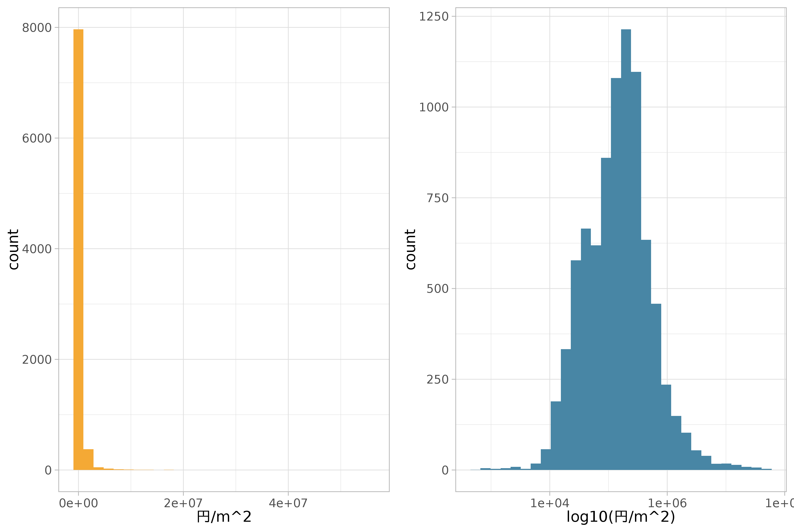
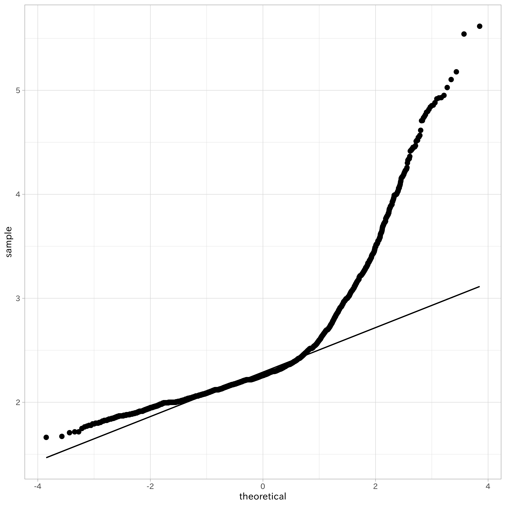
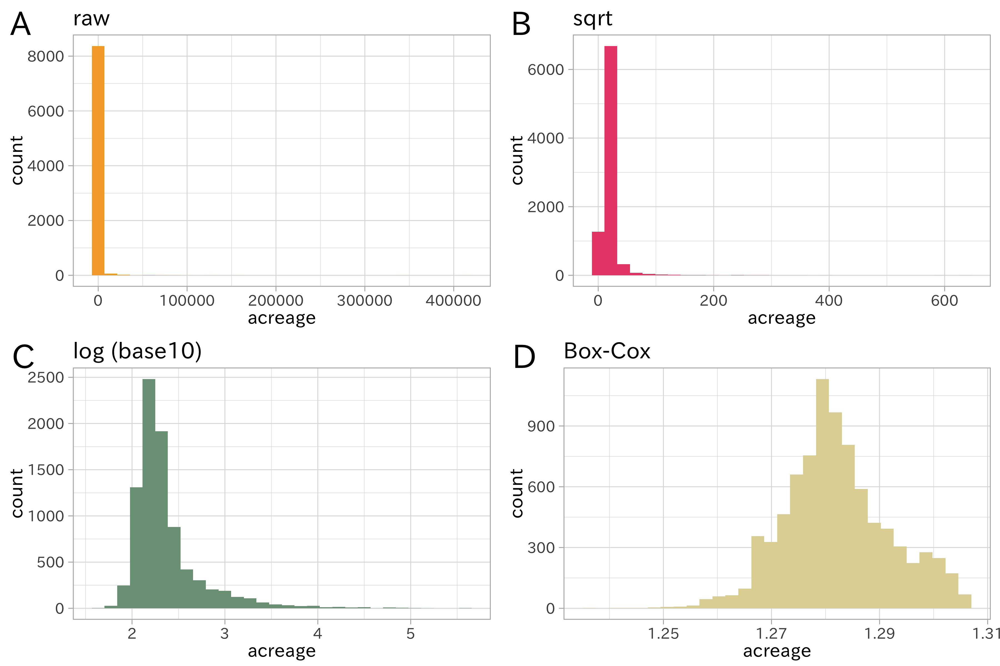
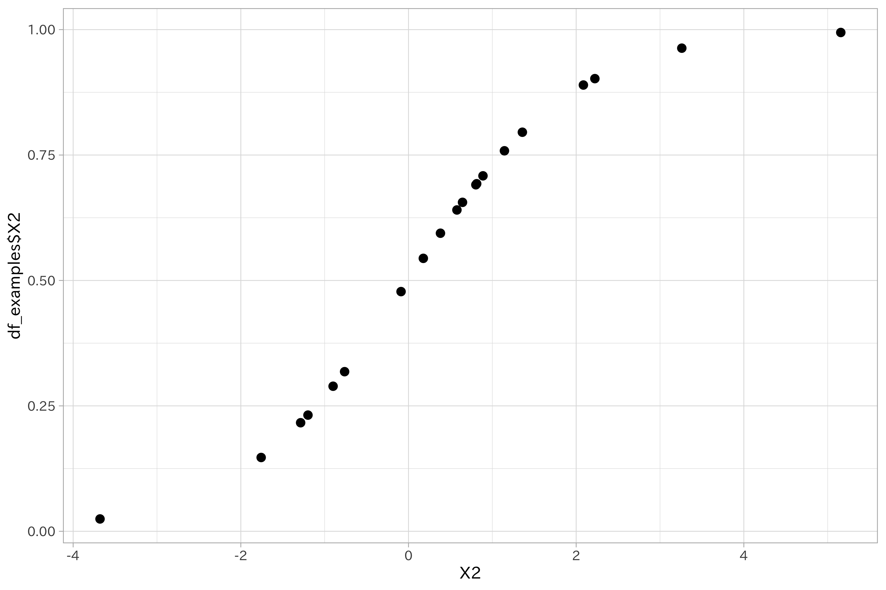
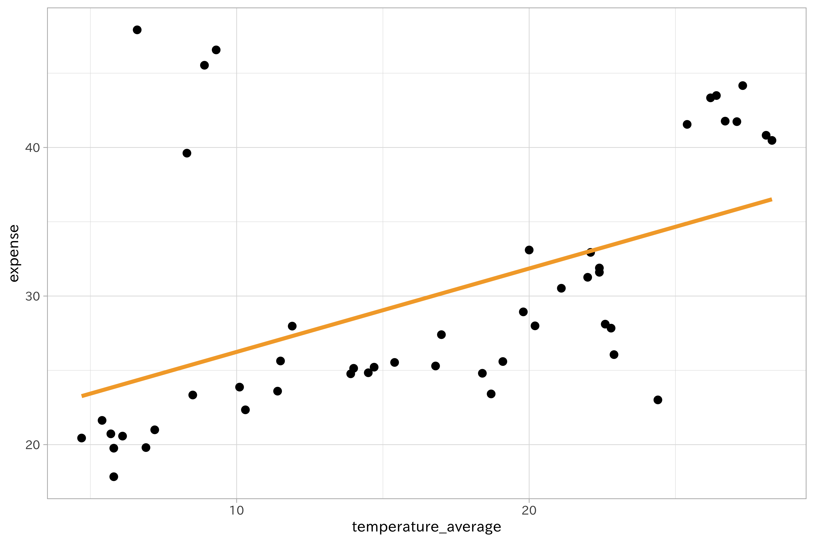
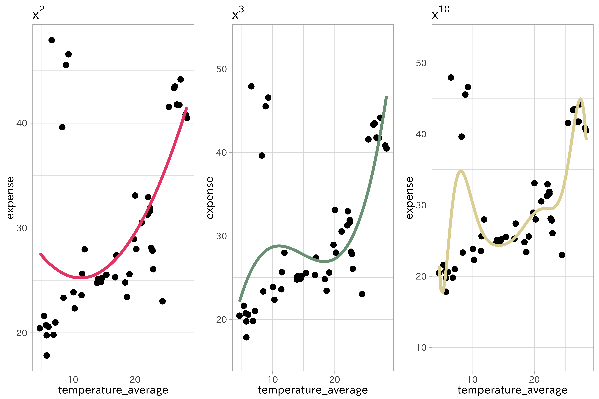
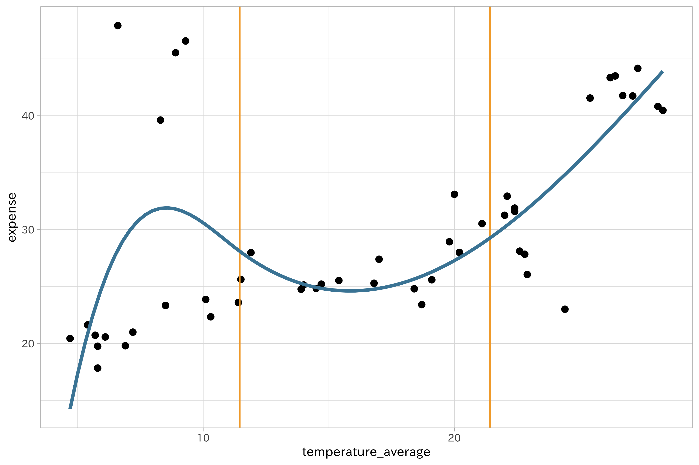
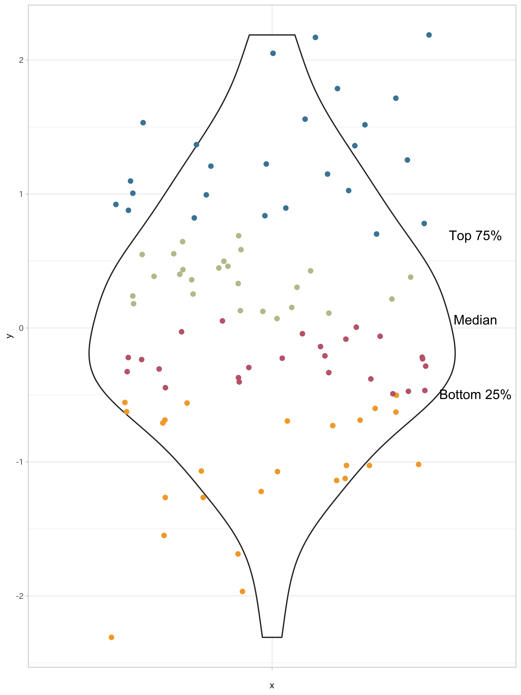
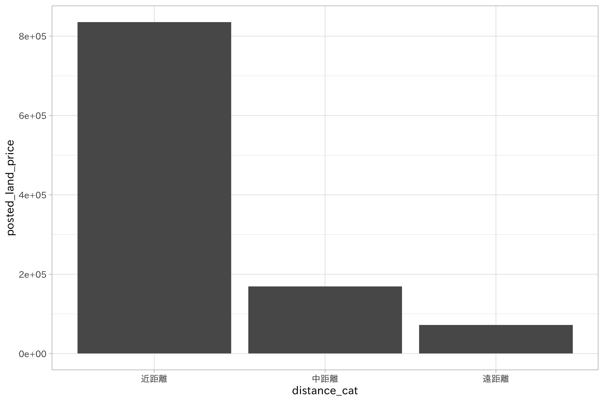
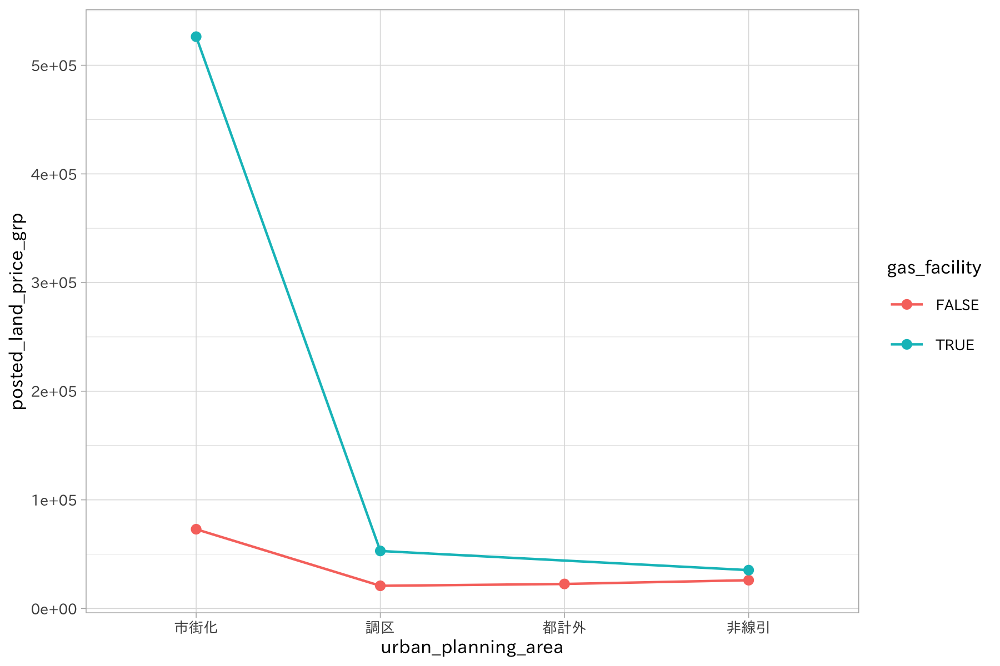

# 数値データの取り扱い

データ分析においてもっとも一般的な型が数値データです。商品の価格やウェブページのアクセス件数、株価の変動など多くのデータが数値で表されます。このことからわかるように、一言で数値データといっても実数から整数、マイナスの値を持つものまで多様な種類が存在します。

多くのモデルが数値の入力を前提としているため、数値をそのまま利用することもできます。しかし特徴量エンジニアリングが不要というわけではありません。具体的には線形回帰モデルでは、出力から得られる値の誤差が正規分布に従うことを仮定します。そのため正規分布とは異なる形状の分布をもつデータ、例えば離散値ではその仮定が成立しないことが可能性があります。この問題を解決するため、元のデータを正規分布に近似させるという特徴量エンジニアリングが有効になります。

良い特徴量というのはデータの特徴を強く反映します。連続的な数値の二値化あるいは離散化により、モデルの精度を改善できる見込みがあります。また数値以外のテキストや画像データを数値化した際、さらなる特徴量エンジニアリングが必要になることがあります。つまり数値データの処理は特徴量エンジニアリングの中で最も基本的な技と言えます。

前章で示した標準化や正規化も数値データの処理ですが、この章では数値変数をモデルに適した形式へと変換する手法を紹介します。元が数値でないデータの扱い各章で解説します。単一の変数を対象にした処理として対数変換、離散化、ハッシュ化を扱います。また複数の特徴量から新たな特徴量を生成する手法や変数間の相互作用について導入を行います。

## 数値データが抱える問題

数値データはありふれたデータ形式ですが、その反面数多くの問題を抱えていることがあります。その特徴をあげてみます。

  - スケールが大きく異なる
  - 歪んだ分布をもつ
  - 大小の外れ値を含む
  - 変数間で、線形では表現できないような複雑な関係を持っている
  - 冗長な情報

これらの問題は、回帰か分類かという課題設定に応じて、適用するモデルの種類によって顕在化します。しかし適切なモデルを選択することで問題のいくつかを軽減できる見込みもあります。例を見てみましょう。

k近傍法やサポートベクターマシンは、特徴空間上の外れ値の影響を受けやすい性質があります。一方で、実際の値ではなく順位化されたデータを利用する木ベースのモデルでは外れ値の影響を軽減可能です。また互いに説明変数の間で強い相関がある変数を重回帰モデルに組み込むと、わずかに値が変動しただけで係数が大きく異なってしまいます。このような状況では部分最小二乗法を用いることで説明変数の相関を無相関化できます。つまり、問題のあるデータに対しては適切なモデルとデータの変換を選択することによりある程度の対策が可能なのです。

数値データに対する特徴量エンジニアリングの作戦は次の3種類に分けて考えられます。

  - 個々の数値変数の問題について直接対処する
  - 変数変換
  - 変数間の関係を見つめ直す

この章では、これらの作戦を個別に紹介してきます。

## 対数変換

数値データの特徴量エンジニアリングとして最初に検討するのが対数変換です。これは[前処理](../01/tidy-data)で扱ったスケール変換と、対象の変数の値を変えるという意味では同じですが、大きな違いがあります。スケール変換では変数のばらつきを元にする変換のために変換後の値でも分布は変わりません。しかし対数変換ではデータの分布が変化します。

対数変換の効果が大きいのは偏りがある数値データです。裾の長いデータ (long tail)
とも呼びます。次の図は地価公示データの地価をヒストグラムにプロットした図と、同じデータに対数変換を施したものです。

{:.input_area}
```R
p_base <- 
  df_lp_kanto %>% 
  ggplot(aes(posted_land_price)) +
  geom_histogram(bins = 30, show.legend = FALSE) +
  scale_fill_identity()

p1 <- p_base + 
  aes(fill = ds_col(1)) +
  xlab("円/m^2")
p2 <- p_base + 
  aes(fill = ds_col(5)) +
  xlab("log10(円/m^2)") +
  scale_x_log10()

plot_grid(
  p1,
  p2,
  ncol = 2)
```



対数変換には次の特徴があります。特徴量のスケールが大きい時はその範囲を縮小し、小さい時は拡大します。これにより、裾の長い分布を押しつぶしたように山のある分布に近づけることができます。また分散が大きなデータでは平均値が大きいほど等分散となりやすい傾向にあります。

### Box-Cox変換

正規分布に従わないデータに対して線形回帰モデルを適用すると推定が思うように行かないことがあります。これは線形回帰モデルが一般に入力に対して正規分布のデータを仮定しているためです。このようなデータでは、正規分布でない分布を背景とする回帰モデルを利用することが一番の対策です。しかしここではデータの分布を変えることでデータを正規分布に近づける方法を紹介しましょう。

ポアソン分布は平均と分散が等しいという性質があります。平均 \(\lambda\)
が大きいほど分散が大きくなり、分布の裾が重くなります。地価公示データの土地の面積を示す変数
`acreage` は裾の重い分布をしてます (ヒストグラムは後ほど作成します)。
このデータを正規分布に近づけるにはどうすれば良いでしょう。先に紹介した対数変換は1つの手段です。

データが正規分布に従っているかは、シャピロ-ウィルクの正規性検定や正規確率グラフ (QQプロット) の描画で確かめられます。
を例に見てみます。元のデータと対数変換した値を使って、シャピロ-ウィルクの正規性検定を行います。この統計手法の帰無仮説は「変数は正規分布にしたがう」です。
\(P < 0.05\) となれば帰無仮説は棄却されます。すなわち正規分布の仮定が保証できなくなります。

{:.input_area}
```R
shapiro.test(sample(df_lp_kanto$acreage, 5000)) %>% tidy()
```

    ## # A tibble: 1 x 3
    ##   statistic  p.value method                     
    ##       <dbl>    <dbl> <chr>                      
    ## 1    0.0347 5.12e-95 Shapiro-Wilk normality test

```R
shapiro.test(log(sample(df_lp_kanto$acreage, 5000))) %>% tidy()
```

    ## # A tibble: 1 x 3
    ##   statistic  p.value method                     
    ##       <dbl>    <dbl> <chr>                      
    ## 1     0.754 1.45e-65 Shapiro-Wilk normality test

{:.input_area}
```R
shapiro.test(log(sample(df_lp_kanto$acreage, 5000), base = 10)) %>% tidy()
```

    ## # A tibble: 1 x 3
    ##   statistic  p.value method                     
    ##       <dbl>    <dbl> <chr>                      
    ## 1     0.759 3.81e-65 Shapiro-Wilk normality test

いずれの結果も統計的有意に帰無仮説を棄却するものでした。続いて正規確率グラフを作成します。このグラフでは、度数分布図で得られた度数の累積値より作成される累積度数分布図の縦軸を変形したもので、データが正規分布に従うのであれば直線上に並ぶというものです。

{:.input_area}
```R
ggplot(df_lp_kanto, aes(sample = log(acreage, base = 10))) + 
  stat_qq() +
  stat_qq_line()
```



対数変換により小さな値の集団は正規分布に近づきましたが、途中から大きくずれてしまいました。これはデータの平均と分散の大きさを反映した結果です。

分散が平均に依存しないように変換をする方法として分散安定変換があります。ポアソン分布に従うデータ \(X\) を平方根で変換すると
\(\tilde{X} = \sqrt{X}\) となり、平均とは無関係に分散がほぼ一定になります。

対数変換と平方根変換を一般化したものとしてBox-Cox変換があります。Box-Cox変換はパラメータ \(\lambda\)
を指定する必要があり、パラメータ \(\lambda\) を変更することで、対数変換
(\(\lambda\) = 0)、平方根変換 (\(\lambda\) = 0.5)、逆数変換 (\(\lambda\) = -1.0)
に対応します。Box-Cox変換は次の式で定義されます。

\[
\tilde{x}=\left\{
\begin{array}{ll}
\frac{x^\lambda-1}{\lambda, }&\lambda \neq 0\\
\ln(x)&\lambda = 0
\end{array}
\right.
\]

土地の面積にBox-Cox変換を施し、改めて正規性の検定を行いましょう。

{:.input_area}
```R
rec_lp_acreage <- 
  recipe(~ acreage, data = df_lp_kanto)

df_lp_acreage_boxcox <- 
  rec_lp_acreage %>% 
  step_BoxCox(all_predictors()) %>%
  prep(training = df_lp_kanto) %>% 
  juice(all_predictors())
```

    ## Warning: All elements of `...` must be named.
    ## Did you want `data = c(type, role, source)`?
    
    ## Warning: All elements of `...` must be named.
    ## Did you want `data = c(type, role, source)`?

{:.input_area}
```R
shapiro.test(sample(df_lp_acreage_boxcox$acreage, 5000)) %>% tidy()
```

    ## # A tibble: 1 x 3
    ##   statistic  p.value method                     
    ##       <dbl>    <dbl> <chr>                      
    ## 1     0.987 5.37e-21 Shapiro-Wilk normality test

{:.input_area}
```R
df_lp_acreage_boxcox %>% 
  ggplot(aes(sample = acreage)) +
  stat_qq() +
  stat_qq_line()
```

統計的には正規分布ではないと判断されましたが、正規確率グラフを見るとより多くのデータが正規分布に近づいていることがわかります。最後に、土地面積のデータにさまざまな変換を施したヒストグラムを比較のために作っておきましょう。




対数変換やBox-Cox変換は、0や負値を扱えないという欠点もあります。そのため、強引に正の値となるような加算の処理をしてから対数変換を行うことがあります。このような処理に対して、足し合わせる数値を下駄に例えて「下駄を履かせる」と表現することがあります。ただしこの「下駄」も負値についても非負値とするために「…を足す」のような処理をすると解釈が難しくなる問題があります。ここでは詳しく解説しませんが、0や負値を含んだ特徴量を扱えるYeo-Johnson変換
(Yeo-Johnson Power Transformations) が効果的な時があります。

{:.input_area}
```R
# 0 や 負値では対数変換が行えない
log(0)
```

    ## [1] -Inf

{:.input_area}
```R
log10(0)
```

    ## [1] -Inf

{:.input_area}
```R
log10(-1)
```

    ## Warning: 計算結果が NaN になりました

    ## [1] NaN

{:.input_area}
```R
# 下駄を履かせる処理
log10(0 + 1)
```

    ## [1] 0

## ロジット変換

数値データの中には、比率や確率のデータも含まれます。この値は0から1の範囲をとりますが、ロジット変換による特徴量エンジニアリングが適用可能です。ロジット変換は次の式で定義されます。

\[
logit(\pi) = \log(\frac{\pi}{1-\pi})
\]

この変換は0から1の値を負と正の無限大の間の値に変換します。つまり変換後の値は正規分布に近づくことが期待されます。またこの値は逆ロジット変換により元の値へ戻せます。

{:.input_area}
```R
set.seed(123)
df_examples <- 
  matrix(runif(40), ncol = 2) %>% 
  data.frame() %>% 
  as_tibble()

df_transformed_examples <- 
  recipe(~ X1 + X2, data = df_examples) %>%
  step_logit(all_predictors()) %>% 
  prep() %>% 
  juice()
```

    ## Warning: All elements of `...` must be named.
    ## Did you want `data = c(type, role, source)`?
    
    ## Warning: All elements of `...` must be named.
    ## Did you want `data = c(type, role, source)`?

ロジット変換を行うと、元のデータとの散布図を取った時に曲線を描くようになります。

{:.input_area}
```R
df_transformed_examples %>% 
  ggplot(aes(X2, df_examples$X2)) +
  geom_point()
```



## より豊かな表現

モデルの表現を豊かにするための特徴量エンジニアリングとして

多項式特徴量や交互作用特徴量が利用可能です。

特に線形モデルでは一般に多項式特徴量、交互作用特徴量を追加することで精度向上が期待されます。

### 非線形特徴量

目的変数と説明変数との関係は常に線形であるとは限りません。次の図は、ビールの支出データより作成した、月間のビール支出金額とその月の平均気温のプロットです。気温が高くなると支出金額も増えているという関係は読めますが、単純な線形関係ではないように見えます。全体に細かな凹凸があったり、平均気温8から10\(^\circ\)Cのあたりで跳ね上がる、25\(^\circ\)Cを超えると一気に増加するという傾向を掴めていません。

このような非線形の関係を捉えるために、統計学の文脈では線形回帰を拡張した非線形回帰の手法が使われますが、これは機械学習の分析でも有効です。ここでは非線形回帰でよく使われる多項式回帰およびスプライン回帰を利用した特徴量の生成方法を学びます。

{:.input_area}
```R
beer_temperature_plot <- 
  df_beer %>%
  ggplot(aes(temperature_average, expense)) +
  geom_point()
```

{:.input_area}
```R
beer_temperature_plot +
  geom_smooth(method = "lm", 
              color = ds_col(1), 
              se = FALSE)
```



<!-- カーネル関数を用いる事でカバー -->

<!-- これらは冒頭に述べたように線形モデルで特に有効です。また解釈が困難という欠点があります。 -->

#### 多項式回帰

線形回帰モデルでは1次の式を扱ってきました。線形モデルから非線形のモデルに当てはめようとする時、最も簡単なのは1次式を2次以上の式に変えてしまうことです。\(y = \beta_{0}+\beta_{1}x\)で表せる線形モデルを3次の式にすると以下のように表現できます。

\[
f(x) = \sum_{i=1}^{3}\beta_{i}f_{i}(x) = \beta_{1}x + \beta_{2}x^2 + \beta_{3}x^3 
\]

多項式特徴量では、多項式回帰により得られる説明変数 \(x\) の2乗項 \(x^2\) や3乗項 \[x^3\] を特徴量として加えます。

{:.input_area}
```R
df_beer %>% 
  recipe(expense ~ temperature_average) %>% 
  step_poly(temperature_average, options = list(degree = 2)) %>% 
  prep(training = df_beer) %>% 
  juice()
```

    ## Warning: All elements of `...` must be named.
    ## Did you want `data = c(type, role, source)`?
    
    ## Warning: All elements of `...` must be named.
    ## Did you want `data = c(type, role, source)`?

    ## # A tibble: 48 x 3
    ##    expense temperature_average_poly_1 temperature_average_poly_2
    ##      <dbl>                      <dbl>                      <dbl>
    ##  1    19.8                    -0.204                      0.173 
    ##  2    20.7                    -0.206                      0.180 
    ##  3    22.3                    -0.117                     -0.0656
    ##  4    24.8                    -0.0359                    -0.170 
    ##  5    30.5                     0.0918                    -0.104 
    ##  6    32.9                     0.111                     -0.0692
    ##  7    43.3                     0.191                      0.141 
    ##  8    41.8                     0.200                      0.174 
    ##  9    28.1                     0.121                     -0.0494
    ## 10    24.8                     0.0396                    -0.165 
    ## # … with 38 more rows

実際に1次の線形モデルに多項式回帰を適用するとスムーズな適合が観察できます。先の気温とビールの支出金額の関係をいくつかの次数(2次、3次、極端な例として10次)で当てはめた多項式回帰の結果を比較しましょう。

{:.input_area}
```R
p1 <- 
  beer_temperature_plot +
  geom_smooth(
    method = "lm",
    se = TRUE,
    fill = NA,
    formula = y ~ poly(x, 2, raw = TRUE),
    colour = ds_col(2)) +
  ggtitle(expression(x^2))

p2 <- 
  beer_temperature_plot +
  geom_smooth(
    method = "lm",
    se = TRUE,
    fill = NA,
    formula = y ~ poly(x, 3, raw = TRUE),
    colour = ds_col(3)) +
  ggtitle(expression(x^3))

p3 <- beer_temperature_plot +
  geom_smooth(
    method = "lm",
    se = TRUE,
    fill = NA,
    formula = y ~ poly(x, 10, raw = TRUE),
    colour = ds_col(4)) +
  ggtitle(expression(x^10))

plot_grid(p1, p2, p3, ncol = 3)
```



次数を増やすことで曲線の滑らかさは増加します。しかしこのデータをモデルに当てはめると過学習を引き起こしやすくなることが指摘されています。加えて、高次データにおいてはデータが少ない領域や境界周辺で極端な挙動を振る舞いを示す傾向にあります。サポートベクターマシンではカーネル関数を用いることで多項式特徴量のような複雑なデータに対応可能なモデルです。

#### スプライン回帰

多項式の次数を増やすことで、望ましくない波状を生み出してしまいます。この問題に対して、スプライン回帰はノット (knots)
と呼ばれる一連の予測変数の固定点領域を滑らかに補間する方法を提供します。

ノットは均等にデータが含まれる領域を分割するように働きます。例えば3ノットのスプラインは33.3%、66.7%の分位点を配置します。この分位点は多項式回帰の結び目として利用されます。そのためスプライン回帰ではパラメータとして多項式の次数とノットの位置を指定する必要があります。

スプライン回帰の注意として、係数の解釈はできない点があります。また最適なノット数を選択するのに、モデルのデータが1次であれば視覚化により確かめられます。あるいは交差検証、一般化交差検証を使用することが可能です。

{:.input_area}
```R
knots <- 
  df_beer$temperature_average %>% 
  quantile(p = c(0.33, 0.667))

# 橙の垂線はノットを示します
beer_temperature_plot + 
    geom_vline(xintercept = knots, color = ds_col(1)) +
   geom_smooth(method = "lm", 
               formula = y ~ splines::bs(x, knots = knots), 
               se = FALSE,
               color = ds_col(5))
```



{:.input_area}
```R
df_beer %>% 
  recipe(expense ~ temperature_average) %>% 
  step_ns(temperature_average) %>% 
  prep(training = df_beer) %>% 
  juice()
```

    ## Warning: All elements of `...` must be named.
    ## Did you want `data = c(type, role, source)`?
    
    ## Warning: All elements of `...` must be named.
    ## Did you want `data = c(type, role, source)`?

    ## # A tibble: 48 x 3
    ##    expense temperature_average_ns_1 temperature_average_ns_2
    ##      <dbl>                    <dbl>                    <dbl>
    ##  1    19.8                   0.0699                  -0.0470
    ##  2    20.7                   0.0636                  -0.0428
    ##  3    22.3                   0.337                   -0.210 
    ##  4    24.8                   0.517                   -0.255 
    ##  5    30.5                   0.557                    0.0469
    ##  6    32.9                   0.538                    0.131 
    ##  7    43.3                   0.422                    0.537 
    ##  8    41.8                   0.405                    0.590 
    ##  9    28.1                   0.527                    0.176 
    ## 10    24.8                   0.579                   -0.136 
    ## # … with 38 more rows

## ビン詰め (ビニング binning)

ビン詰めあるいは離散化は、量的変数を1組あるいはそれ以上のカテゴリに変換する作業です。ここで新たに「ビン」という言葉が出てきました。ビンはカテゴリの値が入る容器だと考えてください。ヒストグラムで使われる「ビン」と同じものです。数値データを扱う際、単一の変数の四分位数を求めることがありますが、それと同じような作業です。四分位数ではデータを4つに区切ります。



すべてのデータが離散化に適しているのではありませんが、離散化が効果を発揮する場面として次の状況が考えられます。

  - 結果の解釈が簡単になる
  - スケールによる影響を緩和する
  - データの変動を抑える

ビン詰めにはいろいろな方法があります。固定幅や分位数を用いるもの、教師なしの方法などです。

地価公示データには、最寄駅からの距離が `distance_from_station`
として与えられています。これはいくつかのカテゴリに分けて考えると良いかもしれません。

### 固定幅による離散化

  - 各階級の範囲をあらかじめ決めておく
  - 階級区分に規則性がある場合とない場合
      - 年齢… 10歳区切り。階級幅は一定で規則性がある
      - 年齢… ライフスタイルによる区切り。規則性がない
  - 10の累乗 (0~9, 10~99, 100~9999) 指数関数的

最寄駅からの距離をいくつかのカテゴリに分けてみましょう。ここでは距離に応じて以下のカテゴリを設定します。

  - 近距離… 800m以内
  - 中距離… 800m~2km
  - 遠距離… 2km以上

<!-- end list -->

{:.input_area}
```R
df_lp_kanto$distance_from_station %>% summary()
```

    ##    Min. 1st Qu.  Median    Mean 3rd Qu.    Max. 
    ##       0     500    1000    1566    1800   24000

{:.input_area}
```R
df_lp_kanto_dist_c <- 
  df_lp_kanto %>% 
  arrange(distance_from_station) %>% 
  mutate(distance_cat = case_when(
    distance_from_station < 800 ~ "近距離", 
    between(distance_from_station, 800, 2000) ~ "中距離",
    distance_from_station > 2000 ~ "遠距離"
  ) %>% 
    forcats::fct_inorder())
```

{:.input_area}
```R
df_lp_kanto_dist_c %>% 
  group_by(distance_cat) %>% 
  summarise(posted_land_price = mean(posted_land_price)) %>% 
  ggplot(aes(distance_cat, posted_land_price)) +
  geom_bar(stat = "identity")
```



### 分位数による離散化

  - 均等に分割

<!-- end list -->

{:.input_area}
```R
# 5段階の階級を設定
binned <- 
  discretize(df_lp_kanto$distance_from_station, 
             cuts = 5, 
             infs = FALSE, 
             keep_na = FALSE,
             prefix = "distance_bins")
table(predict(binned, df_lp_kanto$distance_from_station))
```

    ## 
    ## distance_bins1 distance_bins2 distance_bins3 distance_bins4 distance_bins5 
    ##           1710           1684           1714           1673           1695

{:.input_area}
```R
df_lp_kanto %>% 
  recipe(~ distance_from_station) %>% 
  step_discretize(distance_from_station,
                  options = list(cuts = 3)) %>% 
  prep() %>% 
  juice()
```

    ## Warning: All elements of `...` must be named.
    ## Did you want `data = c(type, role, source)`?
    
    ## Warning: All elements of `...` must be named.
    ## Did you want `data = c(type, role, source)`?

    ## # A tibble: 8,476 x 1
    ##    distance_from_station
    ##    <fct>                
    ##  1 bin3                 
    ##  2 bin3                 
    ##  3 bin3                 
    ##  4 bin3                 
    ##  5 bin1                 
    ##  6 bin3                 
    ##  7 bin2                 
    ##  8 bin2                 
    ##  9 bin1                 
    ## 10 bin1                 
    ## # … with 8,466 more rows

{:.input_area}
```R
# df_lp_kanto %>% 
#   ggplot(aes(distance_from_station, posted_land_price)) +
#   geom_point()
```

<!-- ## 二値化-->

<!-- ビニングや多項式特徴量、-->

## 交互作用特徴量

2つの特徴量を組み合わせることで、単一の特徴量として扱うよりも目的変数との関係が明らかになることがあります。

例えば、

地価の価格の平均値をガス供給施設の有無でグループを分けて描画してみます。

常にガス供給施設がある場合に地価価格が高くなっていますが、市街化では特にその差が離れていることがわかります。

ビールの売り上げについて気温と湿度の交互作用を考えてみましょう。これは気温がビールの売り上げに及ぼす影響を湿度が調整すると考えるものです。

{:.input_area}
```R
df_lp_kanto %>% 
  group_by(urban_planning_area, gas_facility) %>% 
  summarise(posted_land_price_grp = mean(posted_land_price)) %>% 
  ungroup() %>% 
  ggplot(aes(urban_planning_area, posted_land_price_grp, color = gas_facility)) +
  geom_line(aes(group = gas_facility)) +
  geom_point()
```



{:.input_area}
```R
df_beer2018q2 %>% 
  recipe(expense ~ temperature_average +humidity_average_percent) %>% 
  step_interact(terms = ~ temperature_average:humidity_average_percent) %>% 
  prep() %>% 
  juice()
```

    ## Warning: All elements of `...` must be named.
    ## Did you want `data = c(type, role, source)`?

    ## # A tibble: 92 x 4
    ##    temperature_avera… humidity_average_… expense temperature_average_x_hum…
    ##                 <dbl>              <dbl>   <dbl>                      <dbl>
    ##  1               28.1                 75    58.0                      2108.
    ##  2               28.8                 70    42.8                      2016 
    ##  3               28.4                 69    23.9                      1960.
    ##  4               27.6                 75    28.6                      2070 
    ##  5               26.7                 79    35.4                      2109.
    ##  6               21.7                 99    29.1                      2148.
    ##  7               25                   86    53.9                      2150 
    ##  8               27.4                 79    61.6                      2165.
    ##  9               27.3                 86    38.4                      2348.
    ## 10               28.5                 78    33.1                      2223 
    ## # … with 82 more rows

交互作用特徴量は複数の特徴量の積で計算されます。例えば数値変数どうしであれば単純な掛け算です。二値特徴量間では論理積となります。

## 次元集約によると特徴量の作成

  - PCA, ICA
  - L2ノルム正則化… ベクトル空間に対して「距離」を与えるための数学の道具

過学習を防ぐためでもある

<!-- reduction... ここでは概要説明のみ。詳しくは該当する章で-->

## まとめ

<!-- 
> 対数をとるモデルと対数をとらないモデルのどちらか一方が「正しい」わけではない。あくまでも「そういう仮定を選んだ」ということに過ぎない-->

## 関連項目

  - [特徴量選択](feature-selection)

## 参考文献

  - Max Kuhn and Kjell Johnson (2013). Applied Predictive Modeling.
    (Springer)
  - Sarah Guido and Andreas Müller (2016). Introduction to Machine
    Learning with Python A Guide for Data Scientists (O’Reilly) (**翻訳**
    中田秀基訳 (2017). Pythonではじめる機械学習 scikit-learnで学ぶ特徴量エンジニアリングと機械学習の基礎
    (オライリー))
  - Peter Bruce and Andrew Bruce (2017). Practical Statistics for Data
    Scientist - 50 Essential Concepts (O’Reilly) (**翻訳** 黒川利明訳(2018).
    データサイエンスのための統計学入門 - 予測、分類、統計モデリング、統計的機械学習とRプログラミング (オライリー))
  - Max Kuhn and Kjell Johnson (2019). Feature Engineering and
    Selection: A Practical Approach for Predictive Models (CRC Press)
