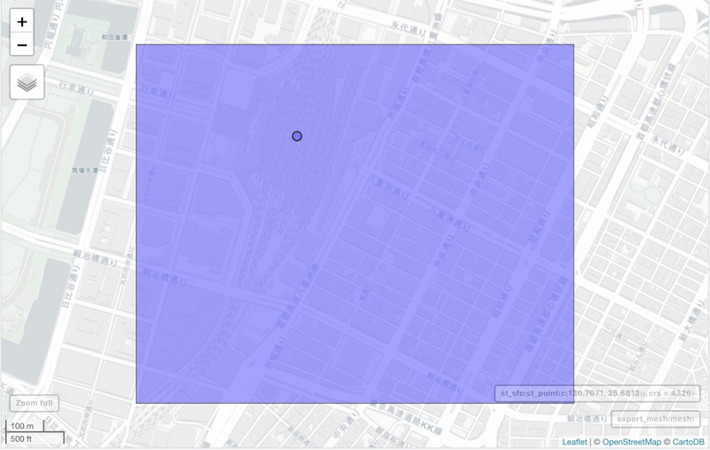
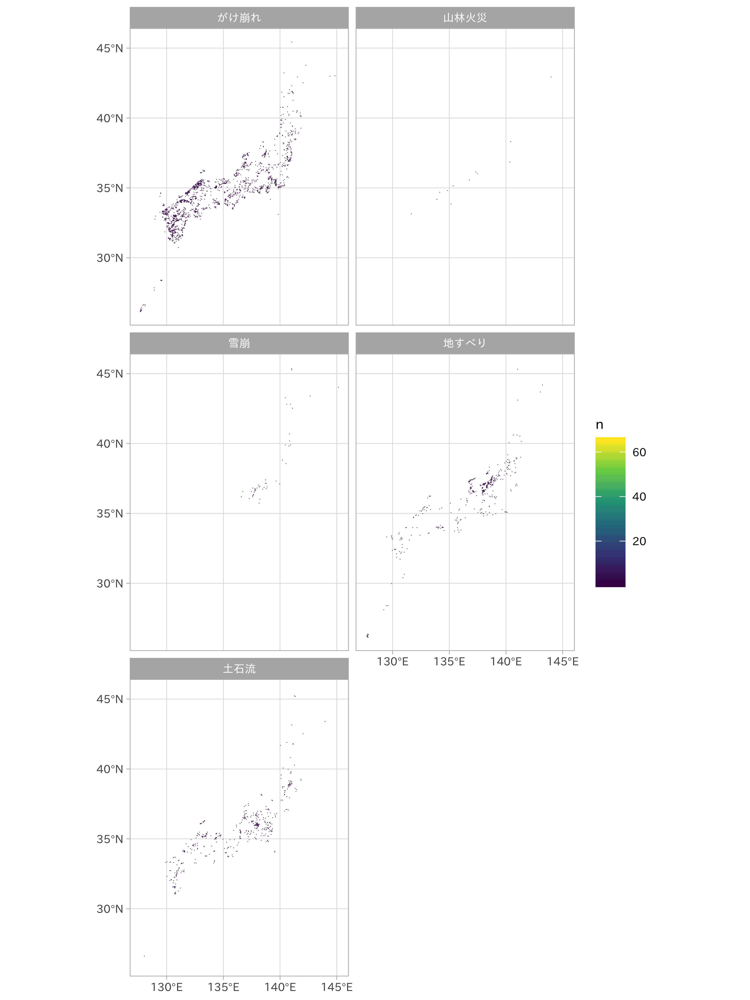

{:.input_area}
```R
source(here::here("R/setup.R"))
source(here::here("R/prepared_landprice.R"))
```


{:.output .output_traceback_line}
```

    Error: Target `df_lp_kanto_sp_baked` failed. Call `diagnose(df_lp_kanto_sp_baked)` for details. Error message:
       オブジェクト 'station' がありません 
    Traceback:


    1. source(here::here("R/prepared_landprice.R"))

    2. withVisible(eval(ei, envir))

    3. eval(ei, envir)

    4. eval(ei, envir)

    5. drake::make(plan_land_price_spatial_fe)

    6. process_targets(config)

    7. run_native_backend(config)

    8. get(paste0("backend_", parallelism), envir = getNamespace("drake"))(config)

    9. loop_build(target = targets[i], config = config, downstream = targets[-seq_len(i)])

    10. conclude_build(build = build, config = config)

    11. handle_build_exceptions(target = target, meta = meta, config = config)

    12. drake_error("Target `", target, "` failed. Call `diagnose(", 
      .     target, ")` for details. Error message:\n  ", meta$error$message, 
      .     config = config)

    13. stop(..., call. = FALSE)


```

# 地理空間データの取り扱い

地理空間データは、スマートフォンやSNSの発達、各種センサーの普及に伴い利用機会が増えています。従来の統計調査や自然環境調査だけでなく、オープンデータやログデータなど、扱う媒介も増えてきており多様な分野・領域で扱われるデータ形式の1つです。なおここでいう地理空間データとは、なんらかのデータに対して地球上の空間的な位置を記録した位置情報を指します。

一方で地理空間データは時系列のデータ同様、他のデータ形式とは異なる特徴を持っており、取り扱いにはいくつかの注意が必要です。また特徴量エンジニアリングの観点からは、位置の情報を利用してさまざまな特徴量を生成できます。

模擬データの中には位置情報を扱うものは2つあります。地価公示データと土砂災害・雪崩メッシュデータです。これらを例にして地理空間データの特性を理解しつつ、特性を生かした特徴量エンジニアリングの手法について紹介します。

## 空間データの特徴

まず空間データがどのようなものか確認しておきましょう。特性を知ることで、不適切な処理を施してしまう危険を回避し、さらによりよい特徴量エンジニアリングの発想が浮かんでくるかもしれません。

### ラスタとベクタ

地理空間データとして扱うデータはラスタとベクタデータに分かれます。

ベクタデータは、現実世界に存在する地物（行政区域など実際には存在しないもの）をデータ上に示したものを指します。ベクタの週類は複数あり、特に点、線、面を扱う場面が多いです。地物は座標と属性情報をもち、地図上で表現可能です。この属性情報は、一般的にテーブル形式で格納され、図形情報と関連づけられています。

- 座標と属性情報をもち、地図上で表現できる
- ポリゴンは、(x,y)の座標値を結んだ閉じた線分として格納される

ラスタデータは主題データ、連続データとも呼ばれ、一定領域を格子状のグリッドで囲んだデータになります。ラスタを構成する各グリッドには値が記録されていて、ピクセルに値を記録する画像データのような情報のまとまりとなっています。ラスタは時系列で重ねることができ、時系列の解析にも利用されます。

模擬データはいずれもベクタデータです。今回ラスタは対象としません。

### 座標参照系

地球上の地物の位置を示すために、座標に加えて座標参照系 (Coordinate Reference System: CRS) の定義が必要になります。これは二次元の座標を地球上に投影するため、位置関係と紐づけて使われます。言い換えると、座標参照系が判明している時にのみ座標を地球の表面に置くことが可能です。

「座標」にはXY座標を使ったものに加えて、緯度経度で表現されるものもあります (地理座標系)。また地図投影法により定義された値 (投影座標系)を座標として使うこともあります。

地図上に地物を重ねる際、意図しない箇所に地物が表示されることがあります。これは地図データの座標系が異なることが原因で発生する問題の一つです。加えて座標系が異なるデータは普通距離が計算できません。この問題については後述します。

ふだん扱う機会の多い、主要な座標参照系として次のものがあります。

- 地理座標系
    - SRID: 4326 (WGS84) 世界測地系、GPSなど
    - SRID: 6668 (JDG2011) 日本測地系2011。東北地方太平洋沖地震による東日本での地殻変動の影響を反映
    - SRID: 4612 (JDG2000) 日本測地系2000。
- 投影座標系... 平面直角座標系
    - SRID: 6669-6687 (JDG2011) 日本の公共測量で採用されている座標系。日本全体を19の地域に分割し、平面投影上の歪みを軽減している

### 空間的影響

地域という空間的な広がりやスケールを持つ対象を扱う地理空間データには、他のデータにはない独自の効果 (空間的影響)が存在します。空間的自己相関 (spatial autocorrelation) と空間的異質性 (spatial heterogeneity) です。

空間的自己相関は時系列データの自己相関のように、互いに近い距離にあるものはより強く影響し合うという考え方です。実際に、人口が集中する地域は楕円状に人口が拡散し、円の外側ほど人口が少ないことがしばしば観察されます。そしてもう一つ、空間的異質性は、空間データの空間的な分散を仮定したものです。つまり、地域が異なれば傾向も異なるという特徴になります。

一般に、回帰モデルでは誤差項 $\epsilon$ が独立で正規分布に従うと仮定されます。ここでの分散均一は、地理空間データでは成立しないことがあります。ここで分散均一としてしまうと、地域性を考慮しないことになってしまいます。そこで地理空間データの回帰モデルでは分散不均一を前提としたモデルが組まれます。

加えて、これらの問題は地理空間データに対して[交差検証](../03/data-splitting)を行う際にも発生します。これについては交差検証の章で議論しますが、地理的に偏りのあるデータをランダムに分割してしまうことで過学習やデータ漏洩に繋がる不安があります。整理すると、空間データの分析には時系列データのように特殊性があり、特に地域性や近隣を考慮した分析の設計が必要になります。

本書ではこれまで地理空間データのモデルに対して、これらの問題を無視して行ってきました。空間構造を考慮することで、モデルがどのように改善されるか、既存のモデルではどのような問題があったかを改めて見ていきましょう。

## 住所の分解と丸め込み

住所は一般に文字列によって構造化されています。我々は次の文字列をみたとき、どのように解釈するでしょうか。

> 東京都千代田区大手町1-1

最後に数値がありますが、これが住所であることは多くの日本人が理解できると思います。一方機械では、[日付・時間データの取り扱い](../02/date-and-time)でみたように基本的にはただの文字列として扱い、構成要素を指定しない限りは住所を分解してくれません。

位置情報として住所が利用可能な時、パターンマッチを使った分割で住所の要素を分解可能です。これは[カテゴリデータ](../02/categorical)の特徴量エンジニアリングで触れた、Expansion encodingになります。例を見てみましょう。


{:.input_area}
```R
"東京都千代田区大手町1-1" %>% 
  stringr::str_split("(?<=東京都|道|府|県)", n = 2)
```


これは都道府県名と以下の住所を分割する処理です。必要とする情報はどのレベルまででしょうか。もし市区町村の情報が必要なのであれば、さらなる分割を試みることになります。しかし、都道府県を分離するようなパターンマッチは実装が容易ですが、市区町村、さらに以下の地名を分割していくことは次第に困難になります。対応すべきパターンと例外が出てくるためです。このような場合、あらかじめ住所文字列が分割された辞書を利用することが、近道となることがあります。

分解に対して、丸め込み可能な状況も考えられます。特に広域のデータであれば詳細な住所よりも荒い住所で集計、特徴量とした方が良いこともあるかもしれません。データのスケールと問題設定により、どの段階までの情報が必要か検討しましょう。

## ジオコーディングと逆ジオコーディング

次は、地理空間データをより地理空間データらしく扱うためのコーディングです。住所ではあくまでも文字列でしたが、位置情報に対して地理座標を付加することで空間的な関係が議論できるようになります。こうした各種の情報から座標を付与する、特定する作業をジオコーディングと呼びます。都道府県の名前は一定の面積をもつポリゴンの座標に変換可能なので、ジオコーディングを行うことができます。対して、特定の座標から住所や地名、メッシュコードを判別させる作業を逆ジオコーディングと呼びます。ジオコーディングと逆ジオコーディングは一般に相互変換が可能な処理です。

ここでは緯度経度をメッシュコードに, メッシュコードから緯度経度にそれぞれ変換する処理を示します。メッシュコード (標準地域コード、標準地域メッシュ)は国勢調査などの、国内全域を調査するために用いられるポリゴンのことで、規模により名称が異なります。一片の長さがおよそ80kmの第1次地域区画がもっとも大きく、10km、1kmと小さくなっていきます。

メッシュコードには位置を特定するための番号が割り振られています。メッシュの大きさによりメッシュコードの長さが異なります。これを使うことで地理空間データとして活用できるようになります。次の表は、標準地域メッシュの体系とメッシュコードの関係を表したものです。

| 地域区画 | 標準地域メッシュ| 規模 | 地域メッシュコードの例 |
|----------|------------------|-----|:-----------------------|
| 第1次地域区画 | | 80km | 5438 |
| 第2次地域区画 | (10倍地域メッシュ) | 10km | 543823 |
| | 5倍地域メッシュ | 5km | 5438234 |
| | 2倍地域メッシュ | 2km | 543823645 |
| 第3次地域区画 | 基準地域メッシュ | 1km  | 54382343 |
| | 1/2地域メッシュ | 500m | 543823431 |
| | 1/4地域メッシュ | 250m | 5438234312 |
| | 1/8地域メッシュ | 125m | 54382343123 |

土砂災害・雪崩メッシュデータに含まれる メッシュコード (`meshCode`) は桁数が7です。つまり5kmの範囲をカバーするメッシュコードだということがわかります。


{:.input_area}
```R
df_hazard %>% 
  select(meshCode)
```


ではメッシュコードからメッシュコードの座標を取得してみましょう。


{:.input_area}
```R
library(jpmesh)
sf_hazard <- 
  df_hazard %>% 
  head() %>% 
  jpmesh::meshcode_sf(meshCode)

sf_hazard$geometry[[1]]
```


RのsfパッケージはRでのベクタ形式の地理空間オブジェクトを操作するのに優れています。メッシュコードの座標はポリゴンとして `geometry` に格納されています。

では今度は緯度経度からメッシュコードを判別させる逆ジオコーディングを行います。


{:.input_area}
```R
mesh <- coords_to_mesh(139.7671, 35.6812)
mesh
```


メッシュコードが得られましたが、これは地図上に表示してみないことにはどこだかわかりにくいです。確認のために地図上にマッピングしてみましょう。


{:.input_area}
```R
library(mapview)
mapview(export_mesh(mesh)) + 
  mapview(st_sfc(st_point(c(139.7671, 35.6812)), crs = 4326))
```




座標からの逆ジオコーディングは、データの空間的な配置を特徴量として活用するために有効です。メッシュコードのような変数をカウントし、期間中に災害発生が起こりやすい場所を集計し、モデルに組み込めるかもしれません。これを確かめるために土砂災害・雪崩メッシュデータから、災害種別でのメッシュ件数をカウントした値を表示してみます。


{:.input_area}
```R
df_hazard_type <- 
  df_hazard %>%
  group_by(hazardType) %>% 
  count(meshCode) %>% 
  ungroup() %>% 
  meshcode_sf(meshCode)

ggplot() +
  geom_sf(data = df_hazard_type, 
          aes(fill = n), 
          color = "transparent") +
  scale_fill_viridis_c() +
  facet_wrap(~ hazardType, ncol = 2)
```




やはり災害発生は種類により地域間での差がありそうです。一方で回数には大きな差がないかもしれません（ただしグラフからは読み取れなくなっていますが、最大で60件以上発生しているメッシュがあることも注意が必要です）。
ここから得られた情報は次のモデルに活用していきます。また、ジオコーディングにより得た座標は、次の地物間の隣接関係や距離計算のために活用可能です。地理空間データの操作を覚えておくことで、特徴量エンジニアリングの幅が大きく広がります。

## 隣接関係

地理空間データの分析では、地物間の重なりや接し方、密集、過疎の状態といった隣接関係が議論されます。

人口集中地区 (DID) 内外

## 距離の計算

特定の地物からの距離は目的変数に対して影響していることがあります。

あらかじめ計算されていますが、これに追加する形で

最寄駅の

乗車人数を加えてみることにします。


{:.input_area}
```R
df_lp_kanto
```


### 参照座標系が異なるために生じる問題


## まとめ

## 関連項目

## 参考文献

- 谷村晋 (2010). 地理空間データ分析 (共立出版)
- 古谷知之 (2011). Rによる空間データの統計分析 (朝倉書店)
- 瀬谷創、堤盛人 (2014). 空間統計学: 自然科学から人文・社会科学まで (朝倉書店)
- Robin Lovelace, Jakub Nowosad, Jannes Muenchow (2019). Geocomputation with R (CRC Press)
