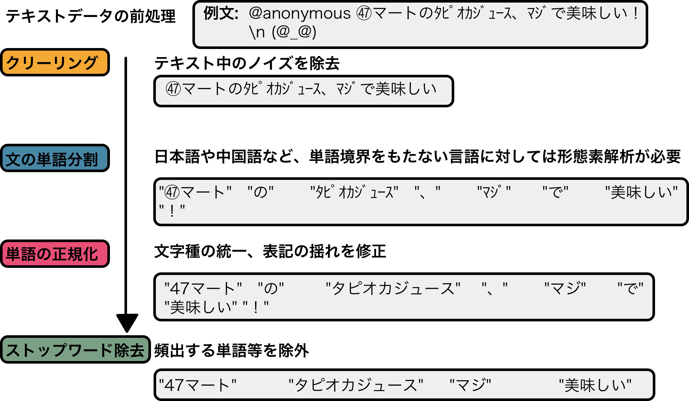

{:.input_area}
```R
source(here::here("R/setup.R"))
```


{:.input_area}
```R
library(textrecipes)
```


# テキストデータの取り扱い


カテゴリを参照

カテゴリより長く、基本的にユニークな値をもつものを扱う

自然言語処理の領域に入ります。

地価公示データの中から、周辺の土地利用の状況が記載された`surrounding_present_usage`を例に解説していきます。まずはこの変数にどのような文字情報が含まれているか確認しておきましょう。

```{r}
na.omit(df_lp_kanto$surrounding_present_usage)[seq_len(10)]
```

テキストデータを扱ううえで大事になってくるのは、文字の長さや区切り位置の有無、そして言語です。

周辺の土地利用の状況は地価公示データのすべてのデータに対して与えられています。ユニークな件数を数えるとおよそデータの半分の数になります。


比較的短文で、重複のあるデータですが

ここでは我々が普段扱う日本語のテキストデータに対象を制限しますが、時には英語を扱うこともあります。

自然言語処理の分野では言語により、扱い方が異なります。


また本来テキストデータとして扱う文字数はこれよりも多いはずですが、基本的な処理は共通です。

日本語や中国語など、単語境界をもたない言語に対しては形態素解析などの前処理が必要になります。

ここでは範囲を超えるので参考資料をみてください。

```{r}
df_lp_surrounding_present_usage_count <- 
  df_lp_kanto %>% 
  count(surrounding_present_usage, sort = TRUE)

nrow(df_lp_surrounding_present_usage_count)
```

```{r, eval = FALSE, echo = TRUE}
df_lp_kanto %>% 
  mutate(nchar = as.character(stringr::str_length(surrounding_present_usage))) %>% 
  count(nchar) %>% 
  ggplot(aes(nchar, n)) +
  geom_bar(stat = "identity") +
  ggtitle("「周辺の土地利用」文字数のカウント") +
  xlab("字数") +
  ylab("データ件数")
```


## テキストの前処理

テキストデータは、その独自の構造のために数値やカテゴリなどとは異なる前処理が必要になります。具体的には、空白文字列の削除、記号や区切り文字の削除、ユニコード正規化などです。



### 不要な文字列の削除

- ハッシュタグ
- URL

特定の文字列に変換するという手法も用いられます。対象の文字列を別のものに変える、すなわち置換の処理は正規表現によるパターンマッチを通して行われるのが一般的です。

### ユニコード正規化

大文字小文字の区別

```{r}
df_lp_kanto %>% 
  filter(str_detect(surrounding_present_usage, "ＩＣ")) %>% 
  pull(surrounding_present_usage)

df_lp_prep <- 
  df_lp_kanto %>% 
  recipe(~ .) %>% 
  step_stri_trans(surrounding_present_usage, trans_id = "nfkc") %>% 
  prep(strings_as_factors = FALSE) %>% 
  juice()

df_lp_prep %>% 
  filter(str_detect(surrounding_present_usage, "IC")) %>% 
  pull(surrounding_present_usage)
```


## Bag-of-Words

* テキスト文書を単語の出現回数のベクトルで表現。
    * 単語がテキストに現れない場合、対応する要素の値は0になる
    * 単語の並び、階層の概念を表現しない。Bag-of-wordsでこれらの意味はない
        * →テキストの意味を正しく理解したい場合にはあまり役立たない
            * Bag-of-n-Grams
* 全ての単語を同じようにしてカウントすると、必要以上に強調される単語が出る
    * 単純な出現頻度だけでは文書の特徴を表現できない
    * 「意味のある」単語が強調されるような特徴を表現する方法を用いるべき


トークン化

```{r}
text_rec <- 
  df_lp_kanto %>% 
  recipe(~ surrounding_present_usage + .row_id) %>% 
  step_tokenize(surrounding_present_usage)

df_lp_token <- 
  text_rec %>% 
  prep() %>% 
  juice() %>% 
  tidyr::unnest(cols = c(surrounding_present_usage))

df_lp_token %>% 
  filter(.row_id == "13534")
```


```{r}
df_lp_texthash <- 
  text_rec %>%
  step_tokenfilter(surrounding_present_usage, max_tokens = 5) %>%
  step_texthash(surrounding_present_usage) %>% 
  prep(retain = TRUE) %>% 
  bake(df_lp_token)
 


df_lp_texthash %>% 
  select(starts_with("surrounding_present_usage_hash")) %>% 
  summarise_all(sd) %>% 
  tidyr::gather() %>% 
  arrange(desc(value))
```

語順を考慮する・しない

考慮しない... 文章の内容を分類
考慮する... n-gram (感情分析)


## 単語の除去

Bag-of-Wordsでは、対象の変数に含まれる単語を元に特徴量が生成されますが、中には価値のない単語も含まれます。こうした単語をあらかじめ取り除いておくことは、特徴選択におけるフィルタ法の作業に相当します。

文章の特徴を反映しないような前置詞や冠詞などはその代表です。データ全体で出現頻度の少ない単語も役立つ可能性は低いです。こうした不要な単語が特徴量に含まれないよう、あらかじめ有用でない単語を除去するという方法が取られます。


### ストップワードによる単語除去

文書の内容に重要でないと考えられる単語をまとめて対象から除外する処理にストップワードが用いられます。ここでの重要でない、は文書中に頻繁に出現する句読点や「です」「ます」などの単語などです。ストップワードの選別には、言語に固有のリスト[^1]を使うか、データセットに応じた頻度の高い単語のリストを作成するか、という選択肢があります。

```{r, eval = TRUE}
df_lp_kanto %>% 
  recipe(~ .) %>%
  step_rm(-acreage, -surrounding_present_usage) %>% 
  step_tokenize(surrounding_present_usage) %>% 
  step_stopwords(surrounding_present_usage, custom_stopword_source = 
                   c("アパート", "住宅", "等", "の", "が")) %>% 
  prep(training = df_lp_kanto) %>% 
  juice() %>% 
  tidyr::unnest(cols = c(surrounding_present_usage)) %>% 
  count(surrounding_present_usage, sort = TRUE)
```

### 出現頻度による単語のフィルタ

```{r}
text_rec %>%
  step_tokenfilter(surrounding_present_usage, min_times = 50) %>% 
  prep() %>% 
  juice() %>% 
  head(1) %>% 
  tidyr::unnest(cols = c(surrounding_present_usage))
```


## tf-idf

TF-IDF TF()とIDF()の積

## 文字列のカウント

```{r}
d <- 
  df_lp_kanto %>% 
  sample_n(10) %>% 
  select(.row_id, surrounding_present_usage)

recipe(~ ., data = d) %>%
  step_tokenize(surrounding_present_usage, token = "words") %>% 
  prep(training = d, retain = TRUE) %>% 
  juice() %>% 
  tidyr::unnest(cols = c(surrounding_present_usage)) %>% 
  group_by(.row_id, surrounding_present_usage) %>% 
  mutate(n = n()) %>% 
  ungroup() %>% 
  arrange(desc(n))

recipe(~ ., data = d) %>% 
  step_count(surrounding_present_usage, pattern = "住宅", result = "count_house") %>% 
  prep(d) %>% 
  juice()
```

```{r}
# step_tokenfilter()
```

## ステミング

形態素?


## まとめ

## 関連項目

- [次元削減](../03/dimension-reduction)

## 参考文献

- Sarah Guido and Andreas Müller (2016). Introduction to Machine Learning with Python A Guide for Data Scientists (O'Reilly) (**翻訳** 中田秀基訳 (2017). Pythonではじめる機械学習
- 石田基広 (2017). Rによるテキストマイニング入門 第2版 (森北出版)
- Julia Silge and David Robinson (2017). [Text Mining with R A Tidy Approach](https://www.tidytextmining.com/) (O'Reilly) (**翻訳** 長尾高弘訳 (2018). Rによるテキストマイニング — tidytextを活用したデータ分析と可視化の基礎 (オライリー))
- Benjamin Bengfort, Tony Ojeda, Rebecca Bilbro (2018). Applied Text Analysis with Python Enabling Language-Aware Data Products with Machine Learning (O'Reilly)
- Alice Zheng and Amanda Casari (2018). Feature Engineering for Machine Learning (O'Reilly) (**翻訳** 株式会社ホクソエム訳 (2019). 機械学習のための特徴量エンジニアリング (オライリー))
